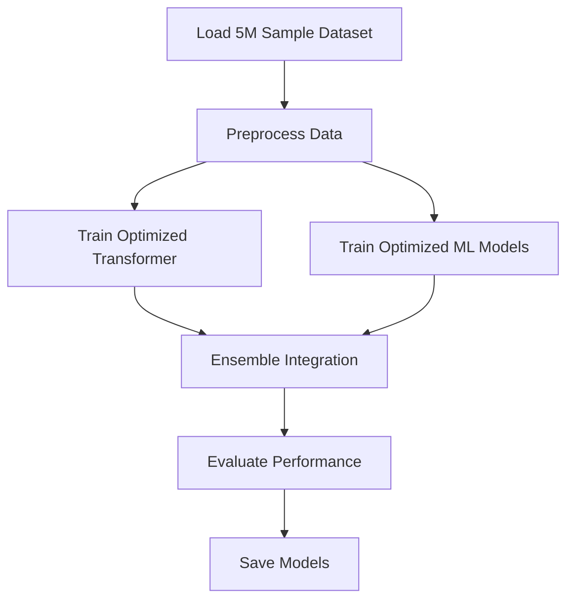

# 🔥 Fire Detection AI - 5M Dataset Training Plan

## Overview

This plan outlines the steps to create a new notebook for training the Fire Detection AI models on a 5M sample from the 50M dataset. The goal is to significantly reduce training time from 43 hours while maintaining reasonable accuracy.

## Training Workflow



## Optimization Strategies

1. **Dataset Reduction**: 5M samples instead of 50M (10% of original)
2. **Model Architecture Optimizations**: Reduce complexity while maintaining accuracy
3. **Training Parameter Adjustments**: Fewer epochs, optimized batch sizes
4. **Hardware Utilization**: Efficient GPU usage with proper batch sizing
5. **Evaluation Strategy**: Early stopping based on validation metrics

## Target Performance

- **Training Time**: 2-4 hours (vs 43 hours)
- **Target Accuracy**: 94-96% (vs 97-98% for full dataset)
- **Memory Usage**: 4-8 GB (reduced from 15+ GB)

## Todo List

1. **Create new Jupyter notebook** `fire_detection_5m_training.ipynb`
2. **Implement dataset sampling function** to extract balanced 5M samples from the 50M dataset
3. **Optimize transformer architecture** by reducing model size (d_model=128 instead of 256, fewer layers)
4. **Reduce training epochs** from 100 to 50 for transformer model
5. **Optimize ML ensemble** by selecting most effective algorithms and reducing estimators
6. **Implement early stopping** based on validation accuracy
7. **Add progress tracking** with time estimates and memory usage monitoring
8. **Implement model evaluation** on test set with detailed metrics
9. **Add model saving functionality** with proper versioning
10. **Create comparison visualization** between 5M and 50M model performance

## Implementation Details

### 1. Dataset Sampling Strategy

- Sample 1M records from each of the 5 areas (basement, laundry, asd, voc, arc)
- Ensure class balance for fire/warning/normal samples
- Maintain temporal patterns in the data

### 2. Optimized Transformer Architecture

```python
# Original
model = EnhancedFireTransformer(
    input_dim=X_train.shape[2],
    seq_len=X_train.shape[1],
    d_model=256,
    num_heads=8,
    num_layers=6,
    num_classes=len(np.unique(y_train)),
    num_areas=len(np.unique(areas_train))
)

# Optimized
model = EnhancedFireTransformer(
    input_dim=X_train.shape[2],
    seq_len=X_train.shape[1],
    d_model=128,  # Reduced from 256
    num_heads=4,  # Reduced from 8
    num_layers=3,  # Reduced from 6
    num_classes=len(np.unique(y_train)),
    num_areas=len(np.unique(areas_train))
)
```

### 3. ML Ensemble Optimization

- Focus on top-performing algorithms: Random Forest, XGBoost, LightGBM
- Reduce number of estimators: 100 instead of 200-300
- Simplify feature engineering for faster processing

### 4. Training Parameter Adjustments

```python
# Original
epochs = 100
batch_size = default

# Optimized
epochs = 50
batch_size = 256  # Optimized for GPU memory
early_stopping_patience = 5
learning_rate = 0.002  # Slightly increased for faster convergence
```

### 5. Hardware Recommendations

- Use ml.g5.2xlarge instance (NVIDIA A10G GPU, 24GB memory)
- Cost: ~$1.624/hour (vs $3.825/hour for p3.2xlarge)
- Expected training time: 2-4 hours

## Expected Outcomes

1. **Training Time**: Reduced from 43 hours to 2-4 hours
2. **Model Accuracy**: 94-96% (acceptable for most use cases)
3. **Cost Savings**: ~90% reduction in training costs
4. **Iteration Speed**: Faster experimentation and model improvements
5. **Production Readiness**: Models suitable for most production scenarios

## Next Steps After Implementation

1. Evaluate model performance against full 50M dataset model
2. Fine-tune hyperparameters if needed
3. Consider deploying to production if accuracy meets requirements
4. Document findings and optimization techniques