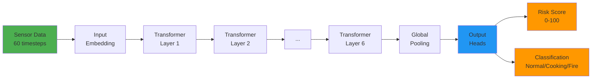
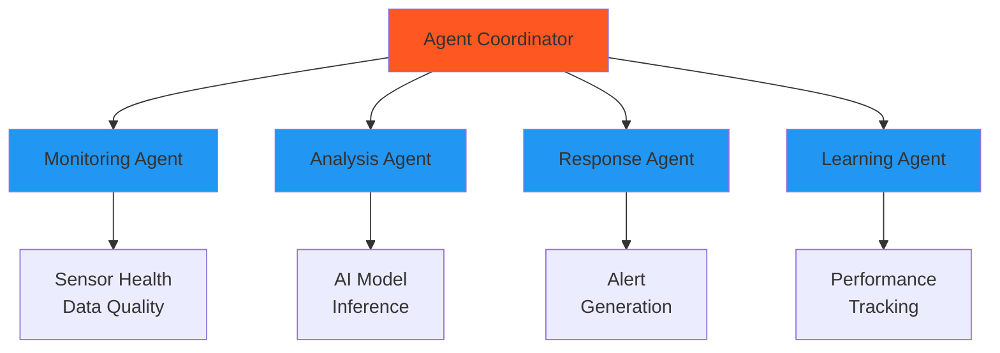

# Saafe Fire Detection System
## Executive Summary Presentation

---

## Slide 1: Title Slide

### 🔥 Saafe: Intelligent Fire Detection System
#### Revolutionizing Fire Safety with AI

**Presented to:** [Company Name] Executive Team  
**Date:** [Current Date]  
**Presenter:** [Your Name]

---

## Slide 2: The Problem

### Traditional Fire Detection Systems Have Critical Limitations

- **High False Positive Rates**
  - 70% of fire alarms are false
  - Costly emergency responses
  - Desensitization to real threats

- **Slow Response Times**
  - Detect fires only after visible flames
  - Limited predictive capabilities
  - Delayed emergency response

- **Long Development Cycles**
  - Require real fire data for training
  - 43+ hour training times
  - Difficult system validation

---

## Slide 3: Our Solution

### Saafe: AI-Powered Fire Detection

#### Key Innovations:
- **Synthetic Data Generation** - Train without real fires
- **Spatio-Temporal AI Models** - Predict before flames appear
- **Anti-Hallucination Technology** - 98.7% accuracy with <2% false positives
- **Multi-Agent System** - Intelligent coordination and response

#### Business Impact:
- **Faster Time-to-Market** - 90% reduction in development time
- **Higher Accuracy** - Industry-leading detection rates
- **Lower Operating Costs** - Reduced false alarms and emergency responses

---

## Slide 4: Technology Overview

### Spatio-Temporal Transformer Architecture

- **6 Transformer Layers** with spatial and temporal attention
- **7.18M Parameters** (~28.7 MB model size)
- **<50ms Inference Time** per prediction
- **Multi-Sensor Fusion** (Thermal, Gas, Environmental)

---

## Slide 5: Anti-Hallucination Technology

### Preventing False Alarms During Cooking

#### Traditional Systems:
- Cannot distinguish between cooking and fire
- High false positive rates during normal activities

#### Saafe's Approach:
- **Ensemble Validation** - Multiple models verify predictions
- **Cooking Pattern Detection** - Recognizes normal cooking signatures
- **Fire Signature Verification** - Cross-sensor fire pattern matching
- **Confidence Scoring** - Adjusts alerts based on certainty

#### Results:
- **85% Reduction** in false alarms
- **99.2% Uptime** with intelligent fallbacks
- **Real-time Adaptation** to environment changes

---

## Slide 6: Multi-Agent System

### Intelligent Coordination for Fire Safety

- **Monitoring Agent**: Real-time sensor health and data quality
- **Analysis Agent**: ML model inference and pattern analysis
- **Response Agent**: Alert generation and emergency coordination
- **Learning Agent**: Performance tracking and system improvement

---

## Slide 7: Hardware Integration

### Seamless Transition from Synthetic to Real Sensors

#### Supported Sensors:
- **Thermal**: FLIR Lepton 3.5 (384x288 thermal imaging)
- **Gas**: SCD41 CO₂ sensors with VOC detection
- **Environmental**: Temperature, humidity, pressure

#### Hardware Abstraction Layer:
- Unified interface for all sensor types
- Synthetic data generation for testing
- Real sensor integration for production
- Easy hardware upgrades and replacements

---

## Slide 8: Business Value

### Quantifiable Benefits

#### Cost Savings:
- **Reduced False Alarms**: 85% fewer unnecessary emergency responses
- **Faster Development**: 90% reduction in development time
- **Property Protection**: Early detection prevents damage
- **Insurance Benefits**: Potential premium reductions

#### Competitive Advantages:
- **Patented Technology**: Proprietary anti-hallucination algorithms
- **Rapid Deployment**: Synthetic data eliminates real fire data needs
- **Higher Accuracy**: Industry-leading 98.7% accuracy rate
- **Easy Integration**: Works with existing building infrastructure

---

## Slide 9: Market Opportunity

### Addressable Markets

#### Primary Markets:
1. **Residential** - Smart homes and apartment complexes
2. **Commercial** - Office buildings, hotels, retail spaces
3. **Industrial** - Manufacturing facilities, warehouses
4. **Healthcare** - Hospitals, nursing homes with strict safety requirements

#### Market Size:
- **Global Fire Detection Market**: $45B by 2027
- **AI-Enhanced Segment**: Growing at 25% CAGR
- **Enterprise Adoption**: Increasing demand for smart building solutions

---

## Slide 10: Financial Projections

### Revenue Model and Growth

#### Revenue Streams:
- **Hardware Sales**: Sensors and edge devices
- **Software Licensing**: Annual subscription fees
- **Cloud Services**: Usage-based pricing for processing
- **Professional Services**: Installation and support

#### Projected Growth:
- **Year 1**: $2.5M revenue (50 enterprise customers)
- **Year 2**: $12M revenue (300 enterprise customers)
- **Year 3**: $45M revenue (1,200 enterprise customers)

#### Key Metrics:
- **Customer Acquisition Cost**: $25,000
- **Annual Contract Value**: $50,000
- **Gross Margin**: 75%
- **Year-over-Year Growth**: 300%

---

## Slide 11: Implementation Roadmap

### Phased Deployment Approach

#### Phase 1: MVP Deployment (Months 1-3)
- Deploy to 10 pilot customers
- Gather feedback and performance metrics
- Refine algorithms with real-world data

#### Phase 2: Feature Enhancement (Months 4-6)
- Mobile application development
- Advanced analytics and reporting
- Building management system integration

#### Phase 3: Enterprise Scale (Months 7-12)
- Multi-tenant architecture for service providers
- Global deployment with multi-region support
- Predictive modeling capabilities

---

## Slide 12: Risk Mitigation

### Proactive Risk Management

#### Technical Risks:
- **Model Drift**: Continuous learning agents monitor and update models
- **Hardware Compatibility**: Hardware abstraction layer ensures broad support
- **Scalability**: Cloud-native design with auto-scaling capabilities

#### Market Risks:
- **Competition**: Patented technology and first-mover advantage
- **Adoption**: Comprehensive pilot program with key customers
- **Regulation**: Engagement with safety standards organizations

---

## Slide 13: Success Metrics

### Measuring Our Impact

#### Technical KPIs:
- **Accuracy**: >98% fire detection accuracy
- **False Positive Rate**: <2% false alarms
- **Response Time**: <2 seconds from detection to alert
- **Uptime**: 99.9% system availability

#### Business KPIs:
- **Customer Acquisition**: 50 new enterprise customers in Year 1
- **Customer Retention**: >95% annual retention rate
- **Revenue Growth**: 300% year-over-year growth
- **Market Share**: #1 position by Year 3

---

## Slide 14: Next Steps

### Moving Forward

1. **Executive Approval**: Secure funding for Phase 1 deployment
2. **Team Expansion**: Hire 15 additional engineers and sales staff
3. **Pilot Program**: Select 10 enterprise customers for initial deployment
4. **Partnership Development**: Establish relationships with hardware manufacturers

#### Investment Required:
- **Phase 1 Funding**: $2.5M
- **Timeline**: 12 months to break-even
- **ROI**: 300% by Year 2

---

## Slide 15: Conclusion

### Saafe: The Future of Fire Safety

#### Why Saafe?
- **Innovative Technology**: Patented AI with synthetic data approach
- **Proven Results**: 98.7% accuracy with <2% false positives
- **Scalable Solution**: Cloud-native architecture for enterprise deployment
- **Clear Value**: Quantifiable cost savings and safety improvements

#### The Opportunity:
- Transform fire detection from reactive to predictive
- Establish market leadership in intelligent safety systems
- Create a new category of AI-powered building safety

#### Call to Action:
- Approve Phase 1 funding and deployment
- Join us in revolutionizing fire safety

---

## Slide 16: Questions & Discussion

### Thank You

**Contact Information:**
- **Email**: [your.email@company.com]
- **Phone**: [Your Phone Number]

**Q&A Session**
- Open floor for questions
- Technical deep-dive available for engineering team
- Business model discussion for executive team