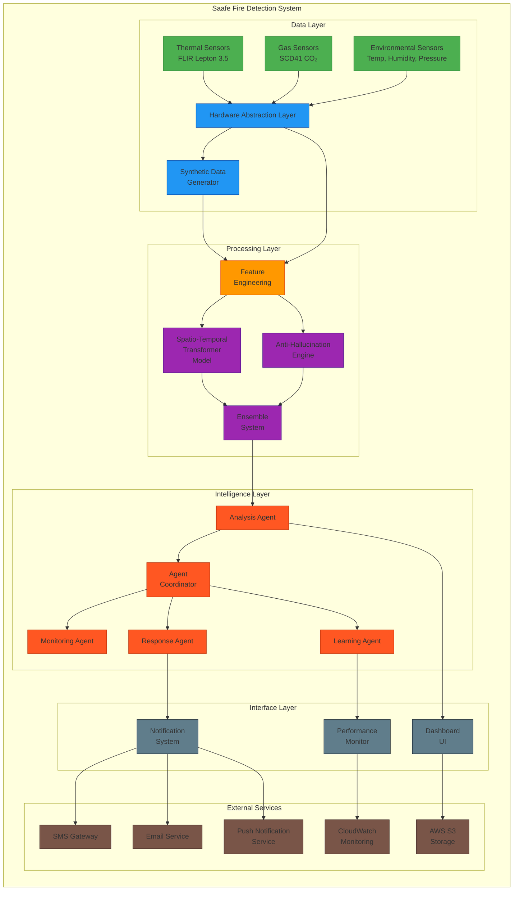

# Saafe Fire Detection System - Architecture Diagram

## Component Descriptions

### Data Layer
- **Thermal Sensors**: FLIR Lepton 3.5 thermal imaging cameras providing 384x288 pixel thermal data
- **Gas Sensors**: SCD41 CO₂ sensors with VOC detection capabilities
- **Environmental Sensors**: Temperature, humidity, and pressure sensors
- **Hardware Abstraction Layer**: Unified interface enabling seamless transition from synthetic to real hardware
- **Synthetic Data Generator**: Creates realistic sensor data for training and testing

### Processing Layer
- **Feature Engineering**: Extracts 18 meaningful features from raw sensor data (15 thermal + 3 gas)
- **Spatio-Temporal Transformer Model**: Deep learning model with 6 transformer layers for pattern recognition
- **Anti-Hallucination Engine**: Prevents false positives during cooking scenarios through ensemble validation
- **Ensemble System**: Combines multiple models for improved accuracy and robustness

### Intelligence Layer
- **Analysis Agent**: Primary consumer of ML models that processes sensor data and generates predictions
- **Agent Coordinator**: Manages communication and coordination between all agents
- **Monitoring Agent**: Continuously monitors sensor health and data quality
- **Response Agent**: Determines appropriate responses and generates alerts
- **Learning Agent**: Tracks performance and manages model retraining

### Interface Layer
- **Dashboard UI**: Real-time monitoring interface with sensor data visualization and alert management
- **Notification System**: Multi-channel alerting system (SMS, Email, Push notifications)
- **Performance Monitor**: System health and performance metrics tracking

### External Services
- **SMS Gateway**: SMS notification delivery service
- **Email Service**: Email notification delivery service
- **Push Notification Service**: Mobile push notification delivery
- **CloudWatch Monitoring**: AWS CloudWatch for system monitoring and alerting
- **AWS S3 Storage**: Amazon S3 for data storage and model artifacts

## Data Flow

1. **Sensor Data Collection**: Real or synthetic sensor data is collected through the Hardware Abstraction Layer
2. **Feature Engineering**: Raw sensor data is processed to extract meaningful features
3. **Model Inference**: Features are fed to the Spatio-Temporal Transformer and Anti-Hallucination models
4. **Ensemble Decision**: Model predictions are combined and validated through the ensemble system
5. **Agent Processing**: Analysis Agent processes results and coordinates with other agents
6. **Response Generation**: Response Agent determines appropriate alerts and notifications
7. **User Interface**: Dashboard displays real-time data and alerts to users
8. **Continuous Learning**: Learning Agent tracks performance and recommends improvements