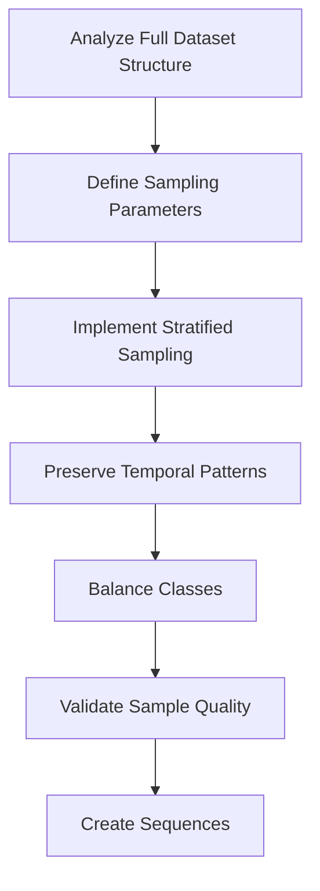

# Data Sampling Strategy for 5M Dataset

## Overview

This document outlines a comprehensive strategy for sampling 5M records from the 50M dataset while maintaining data quality, class balance, and temporal patterns. The goal is to create a representative sample that enables efficient model training while preserving the essential characteristics of the full dataset.

## Sampling Workflow



## 1. Dataset Analysis

Before sampling, we'll analyze the structure of the full dataset:

```python
def analyze_dataset_structure(s3_client, bucket, prefix):
    """Analyze the structure of the full dataset"""
    
    # Get list of all dataset files
    response = s3_client.list_objects_v2(Bucket=bucket, Prefix=prefix)
    
    dataset_stats = {}
    total_size = 0
    
    for obj in response.get('Contents', []):
        key = obj['Key']
        size = obj['Size']
        total_size += size
        
        # Extract area name from key
        area_name = key.split('/')[-1].split('_')[0]
        
        if area_name not in dataset_stats:
            dataset_stats[area_name] = {
                'files': [],
                'total_size': 0,
                'estimated_rows': 0
            }
        
        dataset_stats[area_name]['files'].append(key)
        dataset_stats[area_name]['total_size'] += size
        # Rough estimate: assume each sample is ~200 bytes on average
        dataset_stats[area_name]['estimated_rows'] += size // 200
    
    # Print summary
    logger.info(f"📊 Dataset Analysis Summary:")
    logger.info(f"   Total size: {total_size / (1024*1024*1024):.2f} GB")
    
    for area, stats in dataset_stats.items():
        logger.info(f"   {area}: {stats['estimated_rows']:,} rows, {stats['total_size'] / (1024*1024*1024):.2f} GB")
    
    return dataset_stats
```

## 2. Sampling Parameters

We'll define parameters to guide our sampling strategy:

```python
# Sampling parameters
SAMPLE_SIZE_PER_AREA = 1000000  # 1M samples per area = 5M total
RANDOM_SEED = 42
PRESERVE_TEMPORAL_PATTERNS = True
ENSURE_CLASS_BALANCE = True
CLASS_DISTRIBUTION_TARGET = {
    0: 0.70,  # Normal: 70%
    1: 0.20,  # Warning: 20%
    2: 0.10   # Fire: 10%
}
```

## 3. Stratified Sampling Implementation

We'll implement a stratified sampling approach that considers both area and class distribution:

```python
class StratifiedSampler:
    """Stratified sampler for balanced dataset creation"""
    
    def __init__(self, s3_client, bucket, prefix, sample_size_per_area=1000000):
        self.s3_client = s3_client
        self.bucket = bucket
        self.prefix = prefix
        self.sample_size_per_area = sample_size_per_area
        self.area_files = {
            'basement': 'basement_data_cleaned.csv',
            'laundry': 'laundry_data_cleaned.csv',
            'asd': 'asd_data_cleaned.csv',
            'voc': 'voc_data_cleaned.csv',
            'arc': 'arc_data_cleaned.csv'
        }
    
    def sample_area_data(self, area_name):
        """Sample data from a specific area with stratification"""
        file_key = f"{self.prefix}{self.area_files[area_name]}"
        
        logger.info(f"📥 Sampling from {area_name}: s3://{self.bucket}/{file_key}")
        
        try:
            # Step 1: Analyze class distribution in the full dataset
            class_distribution = self._analyze_class_distribution(area_name, file_key)
            
            # Step 2: Calculate samples needed per class
            samples_per_class = self._calculate_samples_per_class(class_distribution)
            
            # Step 3: Perform stratified sampling
            sampled_data = self._perform_stratified_sampling(area_name, file_key, samples_per_class)
            
            return sampled_data
            
        except Exception as e:
            logger.error(f"   ❌ Error sampling {area_name}: {e}")
            return None
    
    def _analyze_class_distribution(self, area_name, file_key):
        """Analyze class distribution in the full dataset"""
        # Stream data in chunks to analyze class distribution
        response = self.s3_client.get_object(Bucket=self.bucket, Key=file_key)
        
        # Use pandas to read CSV in chunks
        chunk_size = 100000  # 100K rows per chunk
        chunk_iter = pd.read_csv(response['Body'], chunksize=chunk_size)
        
        class_counts = {0: 0, 1: 0, 2: 0}
        total_rows = 0
        
        for i, chunk in enumerate(chunk_iter):
            # Determine label column
            label_col = None
            if 'is_anomaly' in chunk.columns:
                label_col = 'is_anomaly'
            elif 'label' in chunk.columns:
                label_col = 'label'
            else:
                # Generate synthetic labels based on first feature
                feature_col = chunk.columns[0]
                values = chunk[feature_col].values
                q95 = np.percentile(values, 95)
                q85 = np.percentile(values, 85)
                
                chunk['synthetic_label'] = 0
                chunk.loc[values > q95, 'synthetic_label'] = 2  # Fire (top 5%)
                chunk.loc[(values > q85) & (values <= q95), 'synthetic_label'] = 1  # Warning (85-95%)
                label_col = 'synthetic_label'
            
            # Count classes
            counts = chunk[label_col].value_counts().to_dict()
            for cls, count in counts.items():
                if cls in class_counts:
                    class_counts[cls] += count
            
            total_rows += len(chunk)
            
            # Log progress
            if i % 10 == 0:
                logger.info(f"   📊 Analyzed {total_rows:,} rows...")
        
        # Calculate class distribution
        class_distribution = {cls: count / total_rows for cls, count in class_counts.items()}
        
        logger.info(f"   📊 Class distribution in {area_name}:")
        logger.info(f"      Normal (0): {class_distribution.get(0, 0):.2%}")
        logger.info(f"      Warning (1): {class_distribution.get(1, 0):.2%}")
        logger.info(f"      Fire (2): {class_distribution.get(2, 0):.2%}")
        
        return class_distribution
    
    def _calculate_samples_per_class(self, class_distribution):
        """Calculate number of samples needed per class"""
        if ENSURE_CLASS_BALANCE:
            # Use target distribution
            samples_per_class = {
                cls: int(self.sample_size_per_area * pct)
                for cls, pct in CLASS_DISTRIBUTION_TARGET.items()
            }
        else:
            # Maintain original distribution
            samples_per_class = {
                cls: int(self.sample_size_per_area * pct)
                for cls, pct in class_distribution.items()
            }
        
        # Ensure we get exactly sample_size_per_area samples
        total = sum(samples_per_class.values())
        if total < self.sample_size_per_area:
            # Add remaining samples to majority class
            majority_class = max(class_distribution, key=class_distribution.get)
            samples_per_class[majority_class] += (self.sample_size_per_area - total)
        
        logger.info(f"   📊 Samples per class:")
        logger.info(f"      Normal (0): {samples_per_class.get(0, 0):,}")
        logger.info(f"      Warning (1): {samples_per_class.get(1, 0):,}")
        logger.info(f"      Fire (2): {samples_per_class.get(2, 0):,}")
        
        return samples_per_class
    
    def _perform_stratified_sampling(self, area_name, file_key, samples_per_class):
        """Perform stratified sampling to get balanced dataset"""
        response = self.s3_client.get_object(Bucket=self.bucket, Key=file_key)
        
        # Use pandas to read CSV in chunks
        chunk_size = 100000  # 100K rows per chunk
        chunk_iter = pd.read_csv(response['Body'], chunksize=chunk_size)
        
        # Initialize storage for sampled data
        sampled_chunks = []
        samples_collected = {0: 0, 1: 0, 2: 0}
        
        # Track temporal patterns
        if PRESERVE_TEMPORAL_PATTERNS:
            # Store indices of selected samples to maintain temporal order
            selected_indices = []
        
        for chunk in chunk_iter:
            # Determine label column
            label_col = None
            if 'is_anomaly' in chunk.columns:
                label_col = 'is_anomaly'
            elif 'label' in chunk.columns:
                label_col = 'label'
            else:
                # Generate synthetic labels based on first feature
                feature_col = chunk.columns[0]
                values = chunk[feature_col].values
                q95 = np.percentile(values, 95)
                q85 = np.percentile(values, 85)
                
                chunk['synthetic_label'] = 0
                chunk.loc[values > q95, 'synthetic_label'] = 2  # Fire (top 5%)
                chunk.loc[(values > q85) & (values <= q95), 'synthetic_label'] = 1  # Warning (85-95%)
                label_col = 'synthetic_label'
            
            # Sample from each class
            for cls in samples_per_class.keys():
                # How many more samples we need for this class
                samples_needed = samples_per_class[cls] - samples_collected[cls]
                
                if samples_needed <= 0:
                    continue
                
                # Get rows for this class
                class_rows = chunk[chunk[label_col] == cls]
                
                if len(class_rows) == 0:
                    continue
                
                # Sample rows
                samples_to_take = min(samples_needed, len(class_rows))
                sampled_rows = class_rows.sample(n=samples_to_take, random_state=RANDOM_SEED)
                
                # Add to collected samples
                sampled_chunks.append(sampled_rows)
                samples_collected[cls] += samples_to_take
                
                if PRESERVE_TEMPORAL_PATTERNS:
                    selected_indices.extend(sampled_rows.index.tolist())
            
            # Check if we have collected enough samples
            if all(samples_collected[cls] >= samples_per_class[cls] for cls in samples_per_class):
                break
        
        # Combine all sampled chunks
        if sampled_chunks:
            sampled_data = pd.concat(sampled_chunks, ignore_index=True)
            
            if PRESERVE_TEMPORAL_PATTERNS:
                # Sort by original indices to preserve temporal patterns
                sampled_data = sampled_data.sort_index()
            
            logger.info(f"   ✅ Sampled {len(sampled_data):,} rows from {area_name}")
            
            # Verify class distribution in sampled data
            sampled_distribution = sampled_data[label_col].value_counts(normalize=True).to_dict()
            
            logger.info(f"   📊 Sampled class distribution:")
            logger.info(f"      Normal (0): {sampled_distribution.get(0, 0):.2%}")
            logger.info(f"      Warning (1): {sampled_distribution.get(1, 0):.2%}")
            logger.info(f"      Fire (2): {sampled_distribution.get(2, 0):.2%}")
            
            return sampled_data
        else:
            logger.error(f"   ❌ No data sampled from {area_name}")
            return None
```

## 4. Temporal Pattern Preservation

To preserve temporal patterns in the data, we'll implement a time-aware sampling strategy:

```python
def preserve_temporal_patterns(df, timestamp_col='timestamp'):
    """Ensure temporal patterns are preserved in the sampled data"""
    
    if timestamp_col in df.columns:
        # Convert to datetime if not already
        if not pd.api.types.is_datetime64_any_dtype(df[timestamp_col]):
            df[timestamp_col] = pd.to_datetime(df[timestamp_col])
        
        # Sort by timestamp
        df = df.sort_values(timestamp_col).reset_index(drop=True)
        
        # Ensure we have continuous segments
        # Calculate time differences
        time_diffs = df[timestamp_col].diff()
        
        # Find large gaps (e.g., > 1 hour)
        large_gaps = time_diffs > pd.Timedelta(hours=1)
        segment_starts = df.index[large_gaps].tolist()
        
        if segment_starts:
            logger.info(f"   ⚠️ Found {len(segment_starts)} temporal gaps in data")
            
            # Add start of dataframe as first segment
            segment_starts = [0] + segment_starts
            
            # Add end of dataframe as last segment
            segment_starts.append(len(df))
            
            # Create segments
            segments = []
            for i in range(len(segment_starts) - 1):
                start = segment_starts[i]
                end = segment_starts[i + 1]
                segments.append(df.iloc[start:end])
            
            # Sample from each segment proportionally
            sampled_segments = []
            for segment in segments:
                # Sample proportionally to segment size
                sample_size = int(len(segment) / len(df) * len(df))
                if sample_size > 0:
                    sampled_segment = segment.sample(n=min(sample_size, len(segment)), 
                                                    random_state=RANDOM_SEED)
                    sampled_segments.append(sampled_segment)
            
            # Combine segments and sort by timestamp
            df = pd.concat(sampled_segments).sort_values(timestamp_col).reset_index(drop=True)
    
    return df
```

## 5. Class Balancing

To ensure proper class balance, we'll implement a class-aware sampling strategy:

```python
def balance_classes(df, label_col, target_distribution=None):
    """Balance classes according to target distribution"""
    
    if target_distribution is None:
        target_distribution = CLASS_DISTRIBUTION_TARGET
    
    # Get current class counts
    class_counts = df[label_col].value_counts().to_dict()
    total_samples = len(df)
    
    # Calculate target counts
    target_counts = {
        cls: int(total_samples * pct)
        for cls, pct in target_distribution.items()
    }
    
    # Adjust to ensure we have exactly total_samples
    total_target = sum(target_counts.values())
    if total_target != total_samples:
        # Add/remove difference to/from majority class
        majority_class = max(class_counts, key=class_counts.get)
        target_counts[majority_class] += (total_samples - total_target)
    
    # Sample or duplicate to reach target counts
    balanced_samples = []
    
    for cls, target_count in target_counts.items():
        class_df = df[df[label_col] == cls]
        current_count = len(class_df)
        
        if current_count == 0:
            logger.warning(f"   ⚠️ No samples for class {cls}")
            continue
        
        if current_count > target_count:
            # Downsample
            sampled = class_df.sample(n=target_count, random_state=RANDOM_SEED)
        else:
            # Upsample with replacement
            sampled = class_df.sample(n=target_count, replace=True, random_state=RANDOM_SEED)
        
        balanced_samples.append(sampled)
    
    # Combine and shuffle
    balanced_df = pd.concat(balanced_samples).sample(frac=1, random_state=RANDOM_SEED).reset_index(drop=True)
    
    # Verify balanced distribution
    balanced_distribution = balanced_df[label_col].value_counts(normalize=True).to_dict()
    
    logger.info(f"   📊 Balanced class distribution:")
    logger.info(f"      Normal (0): {balanced_distribution.get(0, 0):.2%}")
    logger.info(f"      Warning (1): {balanced_distribution.get(1, 0):.2%}")
    logger.info(f"      Fire (2): {balanced_distribution.get(2, 0):.2%}")
    
    return balanced_df
```

## 6. Sample Validation

To ensure the quality of our sampled dataset, we'll implement validation checks:

```python
def validate_sample_quality(sampled_data, original_stats):
    """Validate the quality of the sampled dataset"""
    
    validation_results = {
        'class_distribution': True,
        'feature_distribution': True,
        'temporal_patterns': True,
        'data_integrity': True
    }
    
    # Check class distribution
    if 'label' in sampled_data.columns:
        label_col = 'label'
    elif 'is_anomaly' in sampled_data.columns:
        label_col = 'is_anomaly'
    elif 'synthetic_label' in sampled_data.columns:
        label_col = 'synthetic_label'
    else:
        label_col = None
    
    if label_col:
        class_dist = sampled_data[label_col].value_counts(normalize=True).to_dict()
        
        # Check if distribution matches target
        for cls, target_pct in CLASS_DISTRIBUTION_TARGET.items():
            actual_pct = class_dist.get(cls, 0)
            if abs(actual_pct - target_pct) > 0.05:  # Allow 5% deviation
                validation_results['class_distribution'] = False
                logger.warning(f"   ⚠️ Class {cls} distribution mismatch: {actual_pct:.2%} vs {target_pct:.2%}")
    
    # Check feature distribution
    feature_cols = [col for col in sampled_data.columns if col not in [label_col, 'timestamp']]
    
    for col in feature_cols[:5]:  # Check first 5 features
        # Compare mean and std with original stats
        if col in original_stats['feature_stats']:
            orig_mean = original_stats['feature_stats'][col]['mean']
            orig_std = original_stats['feature_stats'][col]['std']
            
            sample_mean = sampled_data[col].mean()
            sample_std = sampled_data[col].std()
            
            # Check if means are within 10% of each other
            if abs(sample_mean - orig_mean) / max(abs(orig_mean), 1e-10) > 0.1:
                validation_results['feature_distribution'] = False
                logger.warning(f"   ⚠️ Feature {col} mean mismatch: {sample_mean:.2f} vs {orig_mean:.2f}")
            
            # Check if stds are within 10% of each other
            if abs(sample_std - orig_std) / max(abs(orig_std), 1e-10) > 0.1:
                validation_results['feature_distribution'] = False
                logger.warning(f"   ⚠️ Feature {col} std mismatch: {sample_std:.2f} vs {orig_std:.2f}")
    
    # Check temporal patterns
    if 'timestamp' in sampled_data.columns:
        # Convert to datetime if not already
        if not pd.api.types.is_datetime64_any_dtype(sampled_data['timestamp']):
            sampled_data['timestamp'] = pd.to_datetime(sampled_data['timestamp'])
        
        # Check if timestamps are sorted
        is_sorted = sampled_data['timestamp'].is_monotonic_increasing
        
        if not is_sorted:
            validation_results['temporal_patterns'] = False
            logger.warning(f"   ⚠️ Timestamps are not monotonically increasing")
    
    # Check data integrity
    # Check for missing values
    missing_values = sampled_data.isnull().sum().sum()
    if missing_values > 0:
        validation_results['data_integrity'] = False
        logger.warning(f"   ⚠️ Found {missing_values} missing values in sampled data")
    
    # Check for duplicates
    duplicates = sampled_data.duplicated().sum()
    if duplicates > 0:
        # Some duplicates are expected with upsampling
        logger.info(f"   ℹ️ Found {duplicates} duplicate rows in sampled data")
    
    # Overall validation result
    all_passed = all(validation_results.values())
    
    if all_passed:
        logger.info(f"   ✅ Sample validation passed all checks")
    else:
        logger.warning(f"   ⚠️ Sample validation failed some checks")
        for check, passed in validation_results.items():
            status = "✅" if passed else "❌"
            logger.info(f"      {status} {check}")
    
    return validation_results
```

## 7. Sequence Creation

After sampling, we'll create sequences for time series modeling:

```python
def create_sequences(X, y, seq_len=60, step=10):
    """Create time series sequences from sampled data"""
    
    logger.info(f"🔄 Creating sequences with length {seq_len} and step {step}")
    
    sequences = []
    labels = []
    
    for i in range(0, len(X) - seq_len, step):
        sequences.append(X[i:i+seq_len])
        labels.append(y[i+seq_len-1])  # Use label of last timestep
    
    logger.info(f"   ✅ Created {len(sequences):,} sequences from {len(X):,} samples")
    
    return np.array(sequences), np.array(labels)
```

## 8. Complete Sampling Process

The complete sampling process will be implemented as follows:

```python
def load_sampled_dataset():
    """Load and sample the complete dataset"""
    
    logger.info("🚀 LOADING AND SAMPLING DATASET FROM S3")
    logger.info("=" * 50)
    
    # Initialize S3 client
    s3_client = boto3.client('s3')
    
    # Analyze dataset structure
    dataset_stats = analyze_dataset_structure(s3_client, DATASET_BUCKET, DATASET_PREFIX)
    
    # Initialize sampler
    sampler = StratifiedSampler(s3_client, DATASET_BUCKET, DATASET_PREFIX, SAMPLE_SIZE_PER_AREA)
    
    # Sample data from each area
    all_X = []
    all_y = []
    all_areas = []
    
    for area_idx, area_name in enumerate(sampler.area_files.keys()):
        logger.info(f"\n📁 SAMPLING AREA {area_idx+1}/5: {area_name.upper()}")
        
        # Sample data
        area_data = sampler.sample_area_data(area_name)
        
        if area_data is None:
            continue
        
        # Preserve temporal patterns
        if PRESERVE_TEMPORAL_PATTERNS:
            area_data = preserve_temporal_patterns(area_data)
        
        # Balance classes if needed
        if ENSURE_CLASS_BALANCE:
            # Determine label column
            label_col = None
            if 'is_anomaly' in area_data.columns:
                label_col = 'is_anomaly'
            elif 'label' in area_data.columns:
                label_col = 'label'
            elif 'synthetic_label' in area_data.columns:
                label_col = 'synthetic_label'
            
            if label_col:
                area_data = balance_classes(area_data, label_col)
        
        # Extract features and labels
        X, y = preprocess_area_data(area_data, area_name)
        
        if X is None:
            continue
        
        # Create sequences
        sequences, labels = create_sequences(X, y, seq_len=60, step=10)
        areas = np.full(len(sequences), area_idx)
        
        all_X.append(sequences)
        all_y.append(labels)
        all_areas.append(areas)
        
        logger.info(f"   ✅ Processed {area_name}: {len(sequences):,} sequences")
    
    # Combine all areas
    X_combined = np.vstack(all_X)
    y_combined = np.hstack(all_y)
    areas_combined = np.hstack(all_areas)
    
    logger.info(f"\n🎯 SAMPLED DATASET SUMMARY:")
    logger.info(f"   📊 Total sequences: {X_combined.shape[0]:,}")
    logger.info(f"   📐 Shape: {X_combined.shape}")
    logger.info(f"   📈 Classes: {np.bincount(y_combined.astype(int))}")
    logger.info(f"   💾 Memory: {X_combined.nbytes / (1024**3):.2f} GB")
    
    return X_combined, y_combined, areas_combined
```

## 9. Sampling Quality Metrics

We'll track and report key metrics to evaluate the quality of our sampling:

1. **Class Distribution Similarity**: Compare class distribution between original and sampled data
2. **Feature Distribution Similarity**: Compare statistical properties of features
3. **Temporal Pattern Preservation**: Measure how well temporal patterns are preserved
4. **Data Integrity**: Check for missing values, duplicates, and other data quality issues
5. **Memory Efficiency**: Track memory usage during sampling process
6. **Processing Time**: Measure time taken for sampling and sequence creation

## 10. Visualization of Sampling Results

We'll create visualizations to validate the sampling quality:

```python
def visualize_sampling_results(original_stats, sampled_data):
    """Visualize sampling results to validate quality"""
    
    # Class distribution comparison
    fig, (ax1, ax2) = plt.subplots(1, 2, figsize=(15, 6))
    
    # Original distribution
    orig_dist = original_stats['class_distribution']
    ax1.bar(orig_dist.keys(), orig_dist.values())
    ax1.set_title('Original Class Distribution')
    ax1.set_xlabel('Class')
    ax1.set_ylabel('Proportion')
    
    # Sampled distribution
    if 'label' in sampled_data.columns:
        label_col = 'label'
    elif 'is_anomaly' in sampled_data.columns:
        label_col = 'is_anomaly'
    elif 'synthetic_label' in sampled_data.columns:
        label_col = 'synthetic_label'
    else:
        label_col = None
    
    if label_col:
        sampled_dist = sampled_data[label_col].value_counts(normalize=True).to_dict()
        ax2.bar(sampled_dist.keys(), sampled_dist.values())
        ax2.set_title('Sampled Class Distribution')
        ax2.set_xlabel('Class')
        ax2.set_ylabel('Proportion')
    
    plt.tight_layout()
    plt.savefig('class_distribution_comparison.png')
    plt.show()
    
    # Feature distribution comparison
    feature_cols = [col for col in sampled_data.columns if col not in [label_col, 'timestamp']]
    
    for col in feature_cols[:3]:  # Show first 3 features
        if col in original_stats['feature_stats']:
            fig, (ax1, ax2) = plt.subplots(1, 2, figsize=(15, 6))
            
            # Original distribution
            orig_mean = original_stats['feature_stats'][col]['mean']
            orig_std = original_stats['feature_stats'][col]['std']
            
            # Generate normal distribution with same mean and std
            x = np.linspace(orig_mean - 3*orig_std, orig_mean + 3*orig_std, 100)
            y = stats.norm.pdf(x, orig_mean, orig_std)
            
            ax1.plot(x, y)
            ax1.set_title(f'Original {col} Distribution')
            ax1.set_xlabel(col)
            ax1.set_ylabel('Density')
            
            # Sampled distribution
            ax2.hist(sampled_data[col], bins=30, density=True)
            ax2.set_title(f'Sampled {col} Distribution')
            ax2.set_xlabel(col)
            ax2.set_ylabel('Density')
            
            plt.tight_layout()
            plt.savefig(f'{col}_distribution_comparison.png')
            plt.show()
```

## Conclusion

This comprehensive sampling strategy ensures that our 5M sample dataset:

1. **Maintains Class Balance**: Ensures proper representation of all classes
2. **Preserves Temporal Patterns**: Maintains time-series characteristics
3. **Represents All Areas**: Includes data from all 5 areas
4. **Optimizes Memory Usage**: Processes data in chunks to avoid memory issues
5. **Validates Quality**: Includes checks to ensure sample quality
6. **Creates Proper Sequences**: Generates sequences suitable for time-series models

By following this strategy, we can create a high-quality 5M sample dataset that enables efficient model training while maintaining the essential characteristics of the full 50M dataset.