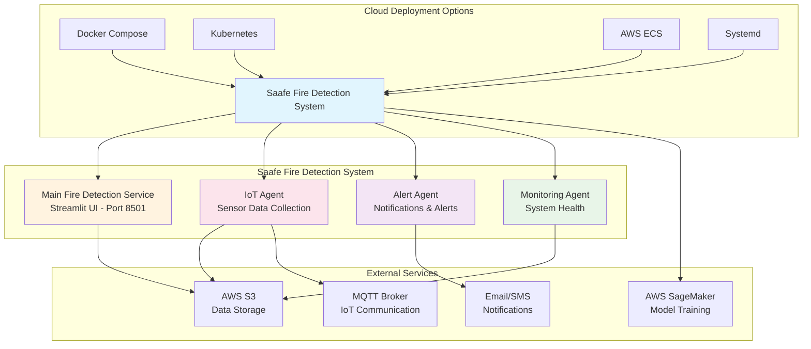

```mermaid
graph TB
    subgraph "Cloud Deployment Options"
        A[Docker Compose] --> B[Saafe Fire Detection System]
        C[Kubernetes] --> B
        D[AWS ECS] --> B
        E[Systemd] --> B
    end
    
    subgraph "Saafe Fire Detection System"
        B --> F[Main Fire Detection Service<br/>Streamlit UI - Port 8501]
        B --> G[IoT Agent<br/>Sensor Data Collection]
        B --> H[Alert Agent<br/>Notifications & Alerts]
        B --> I[Monitoring Agent<br/>System Health]
    end
    
    subgraph "External Services"
        J[AWS S3<br/>Data Storage]
        K[AWS SageMaker<br/>Model Training]
        L[Email/SMS<br/>Notifications]
        M[MQTT Broker<br/>IoT Communication]
    end
    
    F --> J
    G --> J
    G --> M
    H --> L
    I --> J
    B --> K
    
    style B fill:#e1f5fe
    style F fill:#fff3e0
    style G fill:#fce4ec
    style H fill:#f3e5f5
    style I fill:#e8f5e8
```