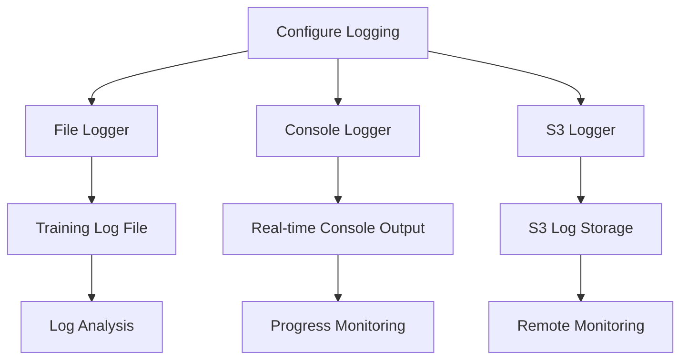

# Error Handling and Logging Strategy

## Overview

This document outlines a comprehensive error handling and logging strategy for the Fire Detection AI 5M training notebook. Proper error handling and logging are critical for:

1. Identifying and diagnosing issues during training
2. Recovering from failures without losing progress
3. Providing visibility into the training process
4. Enabling post-training analysis and debugging

## Logging Architecture



## 1. Logging Configuration

```python
def setup_logging():
    """Configure comprehensive logging for the training process"""
    
    # Create logs directory if it doesn't exist
    os.makedirs('logs', exist_ok=True)
    
    # Generate timestamp for log files
    timestamp = datetime.now().strftime('%Y%m%d_%H%M%S')
    log_file = f'logs/fire_detection_5m_training_{timestamp}.log'
    
    # Configure root logger
    logging.basicConfig(
        level=logging.INFO,
        format='%(asctime)s - %(name)s - %(levelname)s - %(message)s',
        datefmt='%Y-%m-%d %H:%M:%S'
    )
    
    # Get root logger
    logger = logging.getLogger()
    
    # Clear existing handlers
    logger.handlers = []
    
    # Create file handler
    file_handler = logging.FileHandler(log_file)
    file_handler.setLevel(logging.DEBUG)
    file_formatter = logging.Formatter('%(asctime)s - %(name)s - %(levelname)s - %(message)s')
    file_handler.setFormatter(file_formatter)
    
    # Create console handler
    console_handler = logging.StreamHandler()
    console_handler.setLevel(logging.INFO)
    console_formatter = logging.Formatter('%(asctime)s - %(levelname)s - %(message)s')
    console_handler.setFormatter(console_formatter)
    
    # Add handlers to logger
    logger.addHandler(file_handler)
    logger.addHandler(console_handler)
    
    # Create S3 handler if AWS is available
    if AWS_AVAILABLE:
        try:
            s3_handler = S3LogHandler(
                bucket=DATASET_BUCKET,
                key_prefix=f'logs/fire_detection_5m_training_{timestamp}/'
            )
            s3_handler.setLevel(logging.INFO)
            s3_handler.setFormatter(file_formatter)
            logger.addHandler(s3_handler)
            logger.info("✅ S3 logging configured")
        except Exception as e:
            logger.warning(f"⚠️ Failed to configure S3 logging: {e}")
    
    logger.info("🔧 Logging configured successfully")
    logger.info(f"📝 Log file: {log_file}")
    
    return logger

class S3LogHandler(logging.Handler):
    """Custom logging handler that writes logs to S3"""
    
    def __init__(self, bucket, key_prefix):
        super().__init__()
        self.bucket = bucket
        self.key_prefix = key_prefix
        self.buffer = []
        self.buffer_size = 100  # Number of logs to buffer before writing to S3
        self.s3_client = boto3.client('s3')
        
        # Start background thread for uploading logs
        self.stop_event = threading.Event()
        self.upload_thread = threading.Thread(target=self._upload_logs_periodically)
        self.upload_thread.daemon = True
        self.upload_thread.start()
    
    def emit(self, record):
        """Process a log record"""
        log_entry = self.format(record)
        self.buffer.append(log_entry)
        
        # Upload logs if buffer is full
        if len(self.buffer) >= self.buffer_size:
            self._upload_logs()
    
    def _upload_logs(self):
        """Upload buffered logs to S3"""
        if not self.buffer:
            return
        
        try:
            # Create log content
            log_content = '\n'.join(self.buffer)
            
            # Generate key with timestamp
            timestamp = datetime.now().strftime('%Y%m%d_%H%M%S')
            key = f"{self.key_prefix}log_{timestamp}.txt"
            
            # Upload to S3
            self.s3_client.put_object(
                Bucket=self.bucket,
                Key=key,
                Body=log_content
            )
            
            # Clear buffer
            self.buffer = []
            
        except Exception as e:
            # Don't raise exception, just print to stderr
            print(f"Error uploading logs to S3: {e}", file=sys.stderr)
    
    def _upload_logs_periodically(self):
        """Upload logs periodically in background thread"""
        while not self.stop_event.is_set():
            time.sleep(60)  # Upload every minute
            self._upload_logs()
    
    def close(self):
        """Clean up handler resources"""
        self.stop_event.set()
        self._upload_logs()  # Final upload
        super().close()
```

## 2. Error Handling Framework

```python
class TrainingError(Exception):
    """Base class for training-related exceptions"""
    pass

class DataLoadingError(TrainingError):
    """Exception raised for errors during data loading"""
    pass

class ModelInitializationError(TrainingError):
    """Exception raised for errors during model initialization"""
    pass

class TrainingProcessError(TrainingError):
    """Exception raised for errors during training process"""
    pass

class EvaluationError(TrainingError):
    """Exception raised for errors during model evaluation"""
    pass

class ModelSavingError(TrainingError):
    """Exception raised for errors during model saving"""
    pass

def error_handler(func):
    """Decorator for handling errors in functions"""
    @functools.wraps(func)
    def wrapper(*args, **kwargs):
        try:
            return func(*args, **kwargs)
        except TrainingError as e:
            # Log specific training errors
            logger.error(f"❌ {e.__class__.__name__}: {str(e)}")
            # Re-raise to be caught by global handler
            raise
        except Exception as e:
            # Log unexpected errors
            logger.error(f"❌ Unexpected error in {func.__name__}: {str(e)}")
            logger.error(traceback.format_exc())
            # Wrap in TrainingProcessError
            raise TrainingProcessError(f"Error in {func.__name__}: {str(e)}") from e
    return wrapper
```

## 3. Error Handling for Data Loading

```python
@error_handler
def load_area_data_sample(self, area_name, max_samples=SAMPLE_SIZE_PER_AREA):
    """Load and sample area data with error handling"""
    file_key = f"{DATASET_PREFIX}{self.area_files[area_name]}"
    
    logger.info(f"📥 Loading {area_name}: s3://{DATASET_BUCKET}/{file_key}")
    
    try:
        # Check if file exists
        try:
            self.s3_client.head_object(Bucket=DATASET_BUCKET, Key=file_key)
        except Exception as e:
            raise DataLoadingError(f"File not found: s3://{DATASET_BUCKET}/{file_key}")
        
        # Load data in chunks with retry mechanism
        max_retries = 3
        retry_count = 0
        
        while retry_count < max_retries:
            try:
                response = self.s3_client.get_object(Bucket=DATASET_BUCKET, Key=file_key)
                
                # Use pandas to read CSV in chunks
                chunk_size = 100000  # 100K rows per chunk
                chunks = []
                
                # Stream data from S3 in chunks and sample
                chunk_iter = pd.read_csv(response['Body'], chunksize=chunk_size)
                
                total_rows = 0
                for i, chunk in enumerate(chunk_iter):
                    # Sample from chunk based on ratio
                    if max_samples and total_rows + len(chunk) > max_samples:
                        # Calculate how many more samples we need
                        samples_needed = max_samples - total_rows
                        if samples_needed > 0:
                            # Sample remaining rows
                            chunk = chunk.sample(n=samples_needed, random_state=RANDOM_SEED)
                        else:
                            break
                    
                    chunks.append(chunk)
                    total_rows += len(chunk)
                    
                    logger.info(f"   📊 Chunk {i+1}: {len(chunk):,} rows, Total: {total_rows:,}")
                    
                    # Stop if we have enough samples
                    if max_samples and total_rows >= max_samples:
                        break
                
                # Combine chunks
                if not chunks:
                    raise DataLoadingError(f"No data loaded from {area_name}")
                
                df = pd.concat(chunks, ignore_index=True)
                
                logger.info(f"   📊 Loaded {len(df):,} rows from {area_name}")
                
                return self.preprocess_area_data(df, area_name)
                
            except Exception as e:
                retry_count += 1
                if retry_count < max_retries:
                    wait_time = 2 ** retry_count  # Exponential backoff
                    logger.warning(f"   ⚠️ Error loading {area_name}, retrying in {wait_time}s: {e}")
                    time.sleep(wait_time)
                else:
                    raise DataLoadingError(f"Failed to load {area_name} after {max_retries} attempts: {e}")
        
    except DataLoadingError as e:
        # Re-raise specific errors
        raise
    except Exception as e:
        # Wrap other exceptions
        raise DataLoadingError(f"Error loading {area_name}: {e}")
```

## 4. Error Handling for Model Training

```python
@error_handler
def train_transformer_with_early_stopping(X_train, y_train, areas_train, X_val, y_val, areas_val, device):
    """Train the optimized transformer model with error handling"""
    logger.info("🤖 TRAINING OPTIMIZED TRANSFORMER")
    logger.info("=" * 40)
    
    try:
        # Convert to tensors with error checking
        try:
            X_train_tensor = torch.FloatTensor(X_train).to(device)
            X_val_tensor = torch.FloatTensor(X_val).to(device)
            y_train_tensor = torch.LongTensor(y_train).to(device)
            y_val_tensor = torch.LongTensor(y_val).to(device)
            areas_train_tensor = torch.LongTensor(areas_train).to(device)
            areas_val_tensor = torch.LongTensor(areas_val).to(device)
        except Exception as e:
            raise ModelInitializationError(f"Error converting data to tensors: {e}")
        
        # Create model with error checking
        try:
            model = OptimizedFireTransformer(
                input_dim=X_train.shape[2],
                seq_len=X_train.shape[1],
                d_model=128,
                num_heads=4,
                num_layers=3,
                num_classes=len(np.unique(y_train)),
                num_areas=len(np.unique(areas_train))
            ).to(device)
        except Exception as e:
            raise ModelInitializationError(f"Error creating transformer model: {e}")
        
        # Training setup
        optimizer = optim.AdamW(model.parameters(), lr=LEARNING_RATE, weight_decay=0.01)
        scheduler = optim.lr_scheduler.CosineAnnealingLR(optimizer, T_max=EPOCHS)
        criterion = nn.CrossEntropyLoss()
        
        best_val_acc = 0.0
        best_model_state = None
        patience_counter = 0
        
        logger.info(f"Model parameters: {sum(p.numel() for p in model.parameters()):,}")
        logger.info(f"Training for {EPOCHS} epochs with early stopping...")
        
        # Create checkpoint directory
        os.makedirs('checkpoints', exist_ok=True)
        
        start_time = time.time()
        training_history = []
        
        # Training loop with error handling and checkpointing
        for epoch in range(EPOCHS):
            epoch_start_time = time.time()
            
            try:
                # Training
                model.train()
                optimizer.zero_grad()
                
                outputs = model(X_train_tensor, areas_train_tensor)
                loss = criterion(outputs['fire_logits'], y_train_tensor)
                
                loss.backward()
                torch.nn.utils.clip_grad_norm_(model.parameters(), 1.0)
                optimizer.step()
                scheduler.step()
                
                # Validation
                model.eval()
                with torch.no_grad():
                    val_outputs = model(X_val_tensor, areas_val_tensor)
                    val_preds = torch.argmax(val_outputs['fire_logits'], dim=1)
                    val_acc = (val_preds == y_val_tensor).float().mean().item()
                    
                    # Track memory usage
                    if torch.cuda.is_available():
                        memory_usage = torch.cuda.memory_allocated() / 1e9  # GB
                    else:
                        memory_usage = 0
                    
                    # Log progress
                    epoch_time = time.time() - epoch_start_time
                    logger.info(f"Epoch {epoch:3d}: Loss={loss:.4f}, Val_Acc={val_acc:.4f}, "
                               f"Time={epoch_time:.1f}s, Memory={memory_usage:.2f}GB")
                    
                    # Update training history
                    training_history.append({
                        'epoch': epoch,
                        'train_loss': loss.item(),
                        'val_accuracy': val_acc,
                        'learning_rate': scheduler.get_last_lr()[0],
                        'time': epoch_time,
                        'memory_usage': memory_usage
                    })
                    
                    # Check for improvement
                    if val_acc > best_val_acc:
                        best_val_acc = val_acc
                        best_model_state = model.state_dict().copy()
                        patience_counter = 0
                        
                        # Save checkpoint
                        checkpoint_path = f'checkpoints/transformer_epoch_{epoch}_acc_{val_acc:.4f}.pt'
                        torch.save({
                            'epoch': epoch,
                            'model_state_dict': model.state_dict(),
                            'optimizer_state_dict': optimizer.state_dict(),
                            'scheduler_state_dict': scheduler.state_dict(),
                            'val_accuracy': val_acc,
                            'training_history': training_history
                        }, checkpoint_path)
                        logger.info(f"   💾 Saved checkpoint: {checkpoint_path}")
                    else:
                        patience_counter += 1
                    
                    # Early stopping
                    if patience_counter >= EARLY_STOPPING_PATIENCE:
                        logger.info(f"Early stopping at epoch {epoch}")
                        break
                
            except RuntimeError as e:
                # Check if it's an out-of-memory error
                if "CUDA out of memory" in str(e):
                    logger.error(f"❌ CUDA out of memory at epoch {epoch}")
                    logger.error(f"   Try reducing batch size or model size")
                    
                    # Try to recover by clearing cache
                    if torch.cuda.is_available():
                        torch.cuda.empty_cache()
                    
                    # Save current best model before exiting
                    if best_model_state:
                        recovery_path = f'checkpoints/transformer_recovery_acc_{best_val_acc:.4f}.pt'
                        torch.save({
                            'epoch': epoch,
                            'model_state_dict': best_model_state,
                            'val_accuracy': best_val_acc,
                            'training_history': training_history
                        }, recovery_path)
                        logger.info(f"   💾 Saved recovery checkpoint: {recovery_path}")
                    
                    raise TrainingProcessError(f"CUDA out of memory at epoch {epoch}")
                else:
                    # Other runtime errors
                    logger.error(f"❌ Runtime error at epoch {epoch}: {e}")
                    raise TrainingProcessError(f"Runtime error at epoch {epoch}: {e}")
            
            except Exception as e:
                logger.error(f"❌ Error during epoch {epoch}: {e}")
                logger.error(traceback.format_exc())
                
                # Try to save checkpoint before exiting
                if best_model_state:
                    recovery_path = f'checkpoints/transformer_recovery_acc_{best_val_acc:.4f}.pt'
                    torch.save({
                        'epoch': epoch,
                        'model_state_dict': best_model_state,
                        'val_accuracy': best_val_acc,
                        'training_history': training_history
                    }, recovery_path)
                    logger.info(f"   💾 Saved recovery checkpoint: {recovery_path}")
                
                raise TrainingProcessError(f"Error during epoch {epoch}: {e}")
        
        # Load best model
        if best_model_state:
            model.load_state_dict(best_model_state)
        
        training_time = time.time() - start_time
        logger.info(f"✅ Transformer training completed!")
        logger.info(f"   Best validation accuracy: {best_val_acc:.4f}")
        logger.info(f"   Training time: {training_time:.1f}s ({training_time/60:.1f} min)")
        
        return model, best_val_acc, training_history
        
    except Exception as e:
        # Catch any uncaught exceptions
        logger.error(f"❌ Unexpected error in transformer training: {e}")
        logger.error(traceback.format_exc())
        raise TrainingProcessError(f"Unexpected error in transformer training: {e}")
```

## 5. Error Handling for Model Evaluation

```python
@error_handler
def evaluate_ensemble(transformer_model, ml_models, scaler, X_test, y_test, areas_test, device):
    """Evaluate the complete ensemble with error handling"""
    logger.info("🎯 EVALUATING COMPLETE ENSEMBLE")
    logger.info("=" * 35)
    
    try:
        # Get transformer predictions
        transformer_model.eval()
        X_test_tensor = torch.FloatTensor(X_test).to(device)
        areas_test_tensor = torch.LongTensor(areas_test).to(device)
        
        try:
            with torch.no_grad():
                transformer_outputs = transformer_model(X_test_tensor, areas_test_tensor)
                transformer_preds = torch.argmax(transformer_outputs['fire_logits'], dim=1).cpu().numpy()
        except Exception as e:
            logger.error(f"❌ Error getting transformer predictions: {e}")
            logger.error(traceback.format_exc())
            raise EvaluationError(f"Error getting transformer predictions: {e}")
        
        # Get ML model predictions
        try:
            X_test_features = engineer_features(X_test)
            X_test_scaled = scaler.transform(X_test_features)
        except Exception as e:
            logger.error(f"❌ Error engineering features for evaluation: {e}")
            logger.error(traceback.format_exc())
            raise EvaluationError(f"Error engineering features for evaluation: {e}")
        
        predictions = {'transformer': transformer_preds}
        
        for name, model in ml_models.items():
            try:
                if hasattr(model, 'predict'):
                    pred = model.predict(X_test_scaled)
                    predictions[name] = pred
                    acc = accuracy_score(y_test, pred)
                    logger.info(f"   {name}: {acc:.4f}")
            except Exception as e:
                logger.error(f"❌ Error getting predictions from {name}: {e}")
                logger.warning(f"   ⚠️ Skipping {name} in ensemble")
        
        if not predictions:
            raise EvaluationError("No model predictions available for ensemble")
        
        # Ensemble prediction (majority voting)
        try:
            ensemble_preds = []
            
            for i in range(len(y_test)):
                votes = [predictions[name][i] for name in predictions.keys()]
                ensemble_pred = max(set(votes), key=votes.count)
                ensemble_preds.append(ensemble_pred)
            
            ensemble_preds = np.array(ensemble_preds)
            ensemble_acc = accuracy_score(y_test, ensemble_preds)
            
            logger.info(f"\n🏆 ENSEMBLE ACCURACY: {ensemble_acc:.4f} ({ensemble_acc*100:.1f}%)")
            
            # Classification report
            logger.info(f"\n📊 CLASSIFICATION REPORT:")
            report = classification_report(y_test, ensemble_preds, 
                                        target_names=['Normal', 'Warning', 'Fire'])
            logger.info(f"\n{report}")
            
            return ensemble_acc, transformer_preds, ensemble_preds
            
        except Exception as e:
            logger.error(f"❌ Error calculating ensemble predictions: {e}")
            logger.error(traceback.format_exc())
            raise EvaluationError(f"Error calculating ensemble predictions: {e}")
        
    except Exception as e:
        # Catch any uncaught exceptions
        logger.error(f"❌ Unexpected error in ensemble evaluation: {e}")
        logger.error(traceback.format_exc())
        raise EvaluationError(f"Unexpected error in ensemble evaluation: {e}")
```

## 6. Error Handling for Model Saving

```python
@error_handler
def save_models_to_s3(transformer_model, ml_models, scaler, ensemble_acc):
    """Save all models to S3 with error handling"""
    logger.info("💾 SAVING MODELS TO S3")
    logger.info("=" * 25)
    
    try:
        sagemaker_session = sagemaker.Session()
        bucket = sagemaker_session.default_bucket()
        timestamp = datetime.now().strftime('%Y%m%d_%H%M%S')
        
        # Create local directory for models
        os.makedirs('models', exist_ok=True)
        
        # Save transformer
        try:
            transformer_path = f'models/transformer_5m_{timestamp}.pth'
            torch.save({
                'model_state_dict': transformer_model.state_dict(),
                'model_class': 'OptimizedFireTransformer',
                'ensemble_accuracy': ensemble_acc,
                'timestamp': timestamp
            }, transformer_path)
            
            s3_key = f'fire-detection-models/transformer_5m_{timestamp}.pth'
            sagemaker_session.upload_data(transformer_path, bucket, s3_key)
            logger.info(f"   ✅ Transformer: s3://{bucket}/{s3_key}")
        except Exception as e:
            logger.error(f"❌ Error saving transformer model: {e}")
            logger.error(traceback.format_exc())
            raise ModelSavingError(f"Error saving transformer model: {e}")
        
        # Save ML models
        for name, model in ml_models.items():
            try:
                model_path = f"models/{name}_5m_{timestamp}.pkl"
                joblib.dump(model, model_path)
                s3_key = f'fire-detection-models/{name}_5m_{timestamp}.pkl'
                sagemaker_session.upload_data(model_path, bucket, s3_key)
                logger.info(f"   ✅ {name}: s3://{bucket}/{s3_key}")
            except Exception as e:
                logger.error(f"❌ Error saving {name} model: {e}")
                logger.error(traceback.format_exc())
                logger.warning(f"   ⚠️ Skipping {name} model save")
        
        # Save scaler
        try:
            scaler_path = f"models/scaler_5m_{timestamp}.pkl"
            joblib.dump(scaler, scaler_path)
            s3_key = f'fire-detection-models/scaler_5m_{timestamp}.pkl'
            sagemaker_session.upload_data(scaler_path, bucket, s3_key)
            logger.info(f"   ✅ Scaler: s3://{bucket}/{s3_key}")
        except Exception as e:
            logger.error(f"❌ Error saving scaler: {e}")
            logger.error(traceback.format_exc())
            raise ModelSavingError(f"Error saving scaler: {e}")
        
        # Save metadata
        try:
            metadata = {
                'training_completed': datetime.now().isoformat(),
                'ensemble_accuracy': float(ensemble_acc),
                'models_trained': list(ml_models.keys()) + ['transformer'],
                'dataset_size': '5M',
                'target_achieved': ensemble_acc >= 0.95
            }
            
            metadata_path = f"models/training_metadata_5m_{timestamp}.json"
            with open(metadata_path, 'w') as f:
                json.dump(metadata, f, indent=2)
            
            s3_key = f'fire-detection-models/training_metadata_5m_{timestamp}.json'
            sagemaker_session.upload_data(metadata_path, bucket, s3_key)
            logger.info(f"   ✅ Metadata: s3://{bucket}/{s3_key}")
        except Exception as e:
            logger.error(f"❌ Error saving metadata: {e}")
            logger.error(traceback.format_exc())
            logger.warning(f"   ⚠️ Skipping metadata save")
        
        logger.info(f"🎉 All models saved to S3 bucket: {bucket}")
        
    except Exception as e:
        # Catch any uncaught exceptions
        logger.error(f"❌ Unexpected error saving models to S3: {e}")
        logger.error(traceback.format_exc())
        raise ModelSavingError(f"Unexpected error saving models to S3: {e}")
```

## 7. Global Error Handling

```python
def main():
    """Main training function with global error handling"""
    
    # Configure logging
    logger = setup_logging()
    
    try:
        logger.info("🔥" * 80)
        logger.info("FIRE DETECTION AI - 5M DATASET OPTIMIZED TRAINING")
        logger.info("🔥" * 80)
        
        # Setup
        device = torch.device('cuda' if torch.cuda.is_available() else 'cpu')
        logger.info(f"🚀 Device: {device}")
        if torch.cuda.is_available():
            logger.info(f"   GPU: {torch.cuda.get_device_name(0)}")
            logger.info(f"   Memory: {torch.cuda.get_device_properties(0).total_memory / 1e9:.1f} GB")
        
        # Track overall progress
        start_time = time.time()
        time_metrics = {}
        
        # Load data
        data_start = time.time()
        try:
            data_loader = OptimizedDataLoader()
            X, y, areas = data_loader.load_all_data_sample()
            time_metrics['Data Loading'] = time.time() - data_start
        except DataLoadingError as e:
            logger.error(f"❌ Data loading failed: {e}")
            return 1
        
        # Split data
        try:
            X_train, X_test, y_train, y_test, areas_train, areas_test = train_test_split(
                X, y, areas, test_size=0.2, random_state=RANDOM_SEED, stratify=y
            )
            
            X_train, X_val, y_train, y_val, areas_train, areas_val = train_test_split(
                X_train, y_train, areas_train, test_size=0.2, random_state=RANDOM_SEED, stratify=y_train
            )
            
            logger.info(f"📊 Data splits:")
            logger.info(f"   Training: {len(X_train):,}")
            logger.info(f"   Validation: {len(X_val):,}")
            logger.info(f"   Test: {len(X_test):,}")
        except Exception as e:
            logger.error(f"❌ Error splitting data: {e}")
            logger.error(traceback.format_exc())
            return 1
        
        # Train transformer
        transformer_start = time.time()
        try:
            transformer_model, transformer_acc, transformer_history = train_transformer_with_early_stopping(
                X_train, y_train, areas_train, X_val, y_val, areas_val, device
            )
            time_metrics['Transformer Training'] = time.time() - transformer_start
        except TrainingProcessError as e:
            logger.error(f"❌ Transformer training failed: {e}")
            return 1
        
        # Train ML ensemble
        ml_start = time.time()
        try:
            ml_models, ml_results, scaler = train_optimized_ml_ensemble(X_train, y_train, X_val, y_val)
            time_metrics['ML Ensemble Training'] = time.time() - ml_start
        except TrainingProcessError as e:
            logger.error(f"❌ ML ensemble training failed: {e}")
            return 1
        
        # Final evaluation
        eval_start = time.time()
        try:
            ensemble_acc, transformer_preds, ensemble_preds = evaluate_ensemble(
                transformer_model, ml_models, scaler, X_test, y_test, areas_test, device
            )
            time_metrics['Evaluation'] = time.time() - eval_start
        except EvaluationError as e:
            logger.error(f"❌ Ensemble evaluation failed: {e}")
            return 1
        
        # Save models
        save_start = time.time()
        try:
            save_models_to_s3(transformer_model, ml_models, scaler, ensemble_acc)
            time_metrics['Model Saving'] = time.time() - save_start
        except ModelSavingError as e:
            logger.error(f"❌ Model saving failed: {e}")
            # Continue to final summary even if saving fails
        
        # Final summary
        total_time = time.time() - start_time
        
        logger.info("\n" + "🎉" * 80)
        logger.info("TRAINING COMPLETED SUCCESSFULLY!")
        logger.info("🎉" * 80)
        logger.