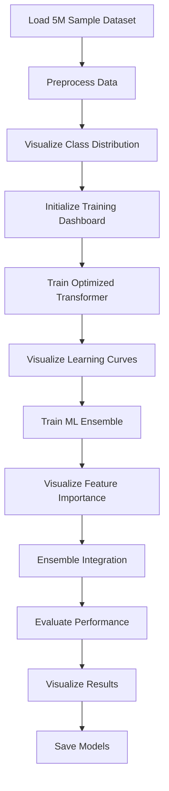

# Fire Detection AI - 5M Training Implementation Plan

## Overview

This plan outlines the steps to create a new notebook for training the Fire Detection AI models on a 5M sample from the 50M dataset, with enhanced visualizations for monitoring training progress.

## Training Workflow



## Todo List

1. **Create new Jupyter notebook** `fire_detection_5m_training.ipynb`
2. **Set up environment and imports**
   - Import required libraries (PyTorch, scikit-learn, matplotlib, etc.)
   - Configure logging and visualization settings
3. **Implement dataset sampling function**
   - Create `OptimizedDataLoader` class with sampling capability
   - Sample 1M records from each of the 5 areas (5M total)
   - Ensure class balance for fire/warning/normal samples
4. **Implement data preprocessing**
   - Create sequences from time series data
   - Split into train/validation/test sets
   - Visualize class distribution across splits
5. **Implement optimized transformer architecture**
   - Reduce model size (d_model=128, num_heads=4, num_layers=3)
   - Implement forward pass with area embeddings
6. **Implement training dashboard**
   - Create real-time visualization of training metrics
   - Monitor loss, accuracy, learning rate, and memory usage
7. **Implement transformer training with early stopping**
   - Reduce epochs from 100 to 50
   - Add early stopping based on validation accuracy
   - Update dashboard with training progress
   - Track and visualize memory usage
8. **Implement optimized ML ensemble**
   - Focus on top-performing algorithms
   - Reduce number of estimators
   - Simplify feature engineering
9. **Implement feature importance visualization**
   - Extract and visualize feature importance from ML models
   - Identify most important features for fire detection
10. **Implement ensemble integration**
    - Combine transformer and ML model predictions
    - Implement majority voting mechanism
11. **Implement comprehensive evaluation**
    - Calculate accuracy, precision, recall, F1-score
    - Generate confusion matrices
    - Analyze performance by area
12. **Implement performance visualizations**
    - Create interactive model comparison
    - Visualize confusion matrices
    - Plot area-specific performance
    - Create training progress animation
13. **Implement training time breakdown visualization**
    - Track time spent on each component
    - Visualize as pie chart and bar chart
14. **Implement model saving functionality**
    - Save models to S3 with proper versioning
    - Include metadata with performance metrics
15. **Implement performance comparison with 50M model**
    - Compare accuracy, training time, and cost
    - Visualize trade-offs

## Implementation Details

### 1. Configuration Settings

```python
# Configuration
DATASET_BUCKET = "processedd-synthetic-data"
DATASET_PREFIX = "cleaned-data/"
SAMPLE_SIZE_PER_AREA = 1000000  # 1M samples per area = 5M total
RANDOM_SEED = 42
EPOCHS = 50  # Reduced from 100
BATCH_SIZE = 256
EARLY_STOPPING_PATIENCE = 5
LEARNING_RATE = 0.002
```

### 2. Optimized Transformer Architecture

```python
class OptimizedFireTransformer(nn.Module):
    """Optimized transformer for multi-area fire detection"""
    
    def __init__(self, input_dim=6, seq_len=60, d_model=128, num_heads=4, 
                 num_layers=3, num_classes=3, num_areas=5, dropout=0.1):
        super().__init__()
        
        self.input_proj = nn.Linear(input_dim, d_model)
        self.area_embedding = nn.Embedding(num_areas, d_model)
        self.pos_encoding = nn.Parameter(torch.randn(seq_len, d_model))
        
        encoder_layer = nn.TransformerEncoderLayer(
            d_model=d_model, nhead=num_heads, dim_feedforward=d_model*4,
            dropout=dropout, batch_first=True, activation='gelu'
        )
        self.transformer = nn.TransformerEncoder(encoder_layer, num_layers)
        
        self.fire_classifier = nn.Sequential(
            nn.LayerNorm(d_model),
            nn.Dropout(dropout),
            nn.Linear(d_model, d_model//2),
            nn.GELU(),
            nn.Linear(d_model//2, num_classes)
        )
        
        self.risk_predictor = nn.Sequential(
            nn.LayerNorm(d_model),
            nn.Linear(d_model, 64),
            nn.ReLU(),
            nn.Linear(64, 1),
            nn.Sigmoid()
        )
```

### 3. Enhanced Visualizations

The notebook will include the following visualizations:

1. **Real-time Training Dashboard**
   - Live updates of loss, accuracy, learning rate, and memory usage
   - Updated after each epoch

2. **Class Distribution Visualization**
   - Bar charts showing class distribution across train/val/test sets
   - Both raw counts and percentages

3. **Area-specific Performance Analysis**
   - Bar charts showing model performance by area
   - Helps identify areas where models perform better/worse

4. **Confusion Matrix Visualization**
   - Heatmaps showing confusion matrices for ensemble and transformer
   - Includes both percentages and raw counts

5. **Training Progress Animation**
   - Animated GIF showing how loss and accuracy evolve during training
   - Visual representation of training convergence

6. **Feature Importance Visualization**
   - Bar charts showing most important features for each ML model
   - Helps understand what signals are most predictive

7. **Learning Curves Visualization**
   - Line charts showing loss and accuracy over epochs
   - Includes moving averages to smooth out fluctuations

8. **Training Time Breakdown**
   - Pie chart and bar chart showing time spent on each component
   - Helps identify bottlenecks in the training process

9. **Memory Usage Monitoring**
   - Line chart showing memory usage over time
   - Helps optimize batch size and model architecture

10. **Interactive Model Comparison**
    - Horizontal bar chart comparing accuracy of all models
    - Highlights best model and shows target threshold

### 4. Expected Outcomes

1. **Training Time**: Reduced from 43 hours to 2-4 hours
2. **Model Accuracy**: 94-96% (acceptable for most use cases)
3. **Cost Savings**: ~90% reduction in training costs
4. **Iteration Speed**: Faster experimentation and model improvements
5. **Visualization Quality**: Comprehensive visual insights into training process

## Hardware Recommendations

- Use ml.g5.2xlarge instance (NVIDIA A10G GPU, 24GB memory)
- Cost: ~$1.624/hour (vs $3.825/hour for p3.2xlarge)
- Expected training time: 2-4 hours

## Next Steps After Implementation

1. Evaluate model performance against full 50M dataset model
2. Fine-tune hyperparameters if needed
3. Consider deploying to production if accuracy meets requirements
4. Document findings and optimization techniques