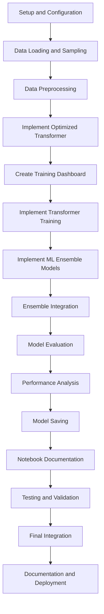

# Fire Detection AI - 5M Training Implementation Todo List

## Overview

This todo list outlines all the steps needed to implement a notebook for training Fire Detection AI models on a 5M sample from the 50M dataset. The implementation includes optimized model architectures, enhanced visualizations, comprehensive error handling, and detailed logging.

## Todo List

### 1. Setup and Configuration

- [ ] Create new Jupyter notebook `fire_detection_5m_training.ipynb`
- [ ] Import required libraries (PyTorch, scikit-learn, matplotlib, etc.)
- [ ] Configure notebook settings (autosave, matplotlib inline, etc.)
- [ ] Implement comprehensive logging setup with file, console, and S3 handlers
- [ ] Define configuration parameters (sample size, random seed, epochs, etc.)
- [ ] Implement custom error handling framework with specific exception types

### 2. Data Loading and Sampling

- [ ] Implement `OptimizedDataLoader` class with error handling
- [ ] Implement dataset structure analysis function
- [ ] Implement stratified sampling strategy for balanced 5M dataset
- [ ] Implement temporal pattern preservation functionality
- [ ] Implement class balancing functionality
- [ ] Implement sample validation checks
- [ ] Visualize class distribution across train/val/test sets

### 3. Data Preprocessing

- [ ] Implement area-specific preprocessing functions
- [ ] Implement feature engineering for time series data
- [ ] Create sequences from time series data
- [ ] Split data into train/validation/test sets
- [ ] Implement data scaling and normalization
- [ ] Visualize feature distributions

### 4. Optimized Transformer Model

- [ ] Implement `OptimizedFireTransformer` class with reduced size
- [ ] Implement forward pass with area embeddings
- [ ] Implement fire classifier and risk predictor components
- [ ] Add model parameter logging and visualization
- [ ] Implement memory usage tracking

### 5. Training Dashboard

- [ ] Implement real-time training dashboard
- [ ] Create plots for loss, accuracy, learning rate, and memory usage
- [ ] Implement dashboard update function
- [ ] Add current values as text annotations

### 6. Transformer Training

- [ ] Implement training loop with early stopping
- [ ] Add checkpointing for best models
- [ ] Implement error recovery mechanisms
- [ ] Track and visualize training metrics
- [ ] Create learning curves visualization
- [ ] Implement training progress animation

### 7. ML Ensemble Models

- [ ] Implement optimized Random Forest model
- [ ] Implement optimized XGBoost model (if available)
- [ ] Implement optimized LightGBM model (if available)
- [ ] Implement feature importance visualization
- [ ] Add error handling for ML model training

### 8. Ensemble Integration

- [ ] Implement majority voting mechanism
- [ ] Combine transformer and ML model predictions
- [ ] Implement error handling for ensemble integration
- [ ] Create interactive model comparison visualization

### 9. Model Evaluation

- [ ] Implement comprehensive evaluation metrics
- [ ] Generate confusion matrices
- [ ] Analyze performance by area
- [ ] Implement error handling for evaluation
- [ ] Create confusion matrix visualization

### 10. Performance Analysis

- [ ] Implement training time breakdown visualization
- [ ] Create performance comparison with 50M model
- [ ] Visualize accuracy vs. training time trade-off
- [ ] Analyze memory usage patterns
- [ ] Generate comprehensive performance report

### 11. Model Saving

- [ ] Implement model saving functionality with error handling
- [ ] Save transformer model to S3
- [ ] Save ML models to S3
- [ ] Save metadata with performance metrics
- [ ] Implement backup saving for error recovery

### 12. Notebook Documentation

- [ ] Add detailed markdown cells explaining each section
- [ ] Document configuration parameters
- [ ] Explain optimization strategies
- [ ] Add instructions for running the notebook
- [ ] Include references to original 50M training code

### 13. Testing and Validation

- [ ] Test data loading with small sample
- [ ] Validate sampling strategy
- [ ] Test transformer training with reduced epochs
- [ ] Verify visualization functionality
- [ ] Test error handling with simulated failures

### 14. Final Integration

- [ ] Ensure all components work together
- [ ] Optimize memory usage
- [ ] Add final summary section
- [ ] Create downloadable HTML report
- [ ] Add cleanup code for temporary files

### 15. Documentation and Deployment

- [ ] Create README with instructions
- [ ] Document hardware requirements
- [ ] Add deployment instructions for SageMaker
- [ ] Include cost estimates
- [ ] Add performance comparison with full 50M model

## Implementation Workflow

## Key Components

1. **Optimized Data Sampling**
   - Stratified sampling for class balance
   - Temporal pattern preservation
   - Memory-efficient loading

2. **Optimized Model Architecture**
   - Reduced transformer size (d_model=128, num_heads=4, num_layers=3)
   - Efficient ML ensemble models
   - Early stopping for faster training

3. **Enhanced Visualizations**
   - Real-time training dashboard
   - Class distribution visualization
   - Area-specific performance analysis
   - Confusion matrix visualization
   - Training progress animation
   - Feature importance visualization
   - Learning curves visualization
   - Training time breakdown
   - Interactive model comparison

4. **Comprehensive Error Handling**
   - Custom exception types
   - Decorator-based error handling
   - Recovery mechanisms
   - Checkpointing

5. **Detailed Logging**
   - Multi-destination logging (file, console, S3)
   - Structured log format
   - Progress tracking
   - Performance metrics

## Expected Outcomes

1. **Training Time**: Reduced from 43 hours to 2-4 hours
2. **Model Accuracy**: 94-96% (acceptable for most use cases)
3. **Cost Savings**: ~90% reduction in training costs
4. **Iteration Speed**: Faster experimentation and model improvements
5. **Visualization Quality**: Comprehensive visual insights into training process
6. **Robustness**: Error handling and recovery mechanisms