# Fire Detection System Dashboard

## Overview
This directory contains multiple dashboard options to visualize the status of your deployed fire detection system. The dashboards show the end-to-end flow from device data collection through to alerting.

## Dashboard Options

### 1. Visual HTML Dashboard (Recommended)
**File:** `fire_detection_dashboard.html`

A browser-based dashboard with visual representations of the system architecture and status.

**To use:**
1. Open `fire_detection_dashboard.html` in any web browser
2. View the real-time status of all system components
3. See the data flow visualization

### 2. Real-Time Terminal Dashboard
**File:** `real_time_dashboard.py`

A text-based dashboard that updates automatically every 30 seconds.

**To use:**
```bash
python3 real_time_dashboard.py
```

Press `Ctrl+C` to exit.

### 3. Static Documentation Dashboard
**File:** `FIRE_DETECTION_DASHBOARD.md`

A comprehensive Markdown document with detailed system information and diagrams.

**To use:**
1. Open in any Markdown viewer or editor
2. View detailed system architecture and status information

## System Components Visualization

The dashboards show the following end-to-end flow:

```mermaid
graph TB
    A[📡 Raspberry Pi Devices] --> B[S3 Bucket<br/>data-collector-of-first-device]
    B --> C[Lambda Function<br/>saafe-s3-data-processor]
    C --> D[SageMaker Endpoint<br/>fire-mvp-xgb-endpoint]
    D --> E[SNS Topic<br/>fire-detection-alerts]
    E --> F[📧 Alert Subscribers]
```



## Current System Status

✅ **Devices Deployed**: Successfully sending data to S3
✅ **S3 Ingestion**: Operational with 20+ files
✅ **Lambda Processing**: Function deployed and configured
✅ **SageMaker Inference**: Endpoint InService
✅ **SNS Alerting**: Topic created (subscriptions needed)

## Next Steps

1. **Configure Alerting**: Add subscriptions to the SNS topic to receive alerts
2. **Monitor Processing**: Use CloudWatch to monitor Lambda function logs
3. **Test End-to-End**: Run the high-frequency processing script to verify complete workflow
4. **Set Up Automation**: Create CloudWatch alarms for system health monitoring

## Troubleshooting

If dashboards don't show expected data:
1. Verify AWS credentials are configured
2. Check that you have permissions for all services
3. Ensure the Python environment has required dependencies:
   ```bash
   pip install boto3 pandas numpy
   ```

## Contact Information

For system administration:
- AWS Account: 691595239825
- Region: us-east-1
- Primary Contact: [Add your contact information here]