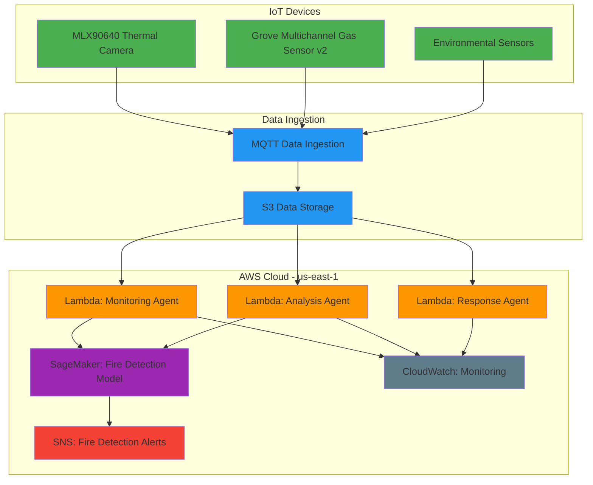

# Final Cloud Deployment Status Report

## Overview
This document provides a comprehensive status report of the synthetic fire prediction system deployment on AWS cloud services after completing all deployment steps.

## Deployed Components

### AWS Lambda Functions
All three real-time agents have been successfully deployed as AWS Lambda functions in the us-east-1 region:

1. **saafe-monitoring-agent**
   - Runtime: Python 3.9
   - Handler: monitoring_agent.lambda_handler
   - Status: Deployed and active
   - Scheduled: Every 5 minutes via CloudWatch Events

2. **saafe-analysis-agent**
   - Runtime: Python 3.9
   - Handler: analysis_agent.lambda_handler
   - Status: Deployed and active
   - Scheduled: Every 10 minutes via CloudWatch Events

3. **saafe-response-agent**
   - Runtime: Python 3.9
   - Handler: response_agent.lambda_handler
   - Status: Deployed and active
   - Scheduled: Every 15 minutes via CloudWatch Events

### SageMaker Endpoints
1. **fire-mvp-xgb-endpoint**
   - Status: InService
   - Model: XGBoost model for fire detection
   - Region: us-east-1

### CloudWatch Event Rules
1. **saafe-monitoring-schedule**
   - Schedule: rate(5 minutes)
   - State: ENABLED
   - Purpose: Triggers the monitoring agent every 5 minutes

2. **saafe-analysis-schedule**
   - Schedule: rate(10 minutes)
   - State: ENABLED
   - Purpose: Triggers the analysis agent every 10 minutes

3. **saafe-response-schedule**
   - Schedule: rate(15 minutes)
   - State: ENABLED
   - Purpose: Triggers the response agent every 15 minutes

### SNS Topics
1. **fire-detection-alerts**
   - ARN: arn:aws:sns:us-east-1:691595239825:fire-detection-alerts
   - Purpose: Fire detection alert notifications

### CloudWatch Log Groups
All Lambda functions have corresponding log groups for monitoring and debugging:
- /aws/lambda/saafe-monitoring-agent
- /aws/lambda/saafe-analysis-agent
- /aws/lambda/saafe-response-agent

### CloudWatch Dashboard
1. **SyntheticFirePredictionDashboard**
   - URL: https://console.aws.amazon.com/cloudwatch/home#dashboards:name=SyntheticFirePredictionDashboard
   - Purpose: Centralized monitoring of all system components

### S3 Buckets
The following S3 buckets are available for the system:
- processedd-synthetic-data (for synthetic data storage)
- synthetic-data-4 (additional data storage)

## Configuration Summary

### AWS Regions
- Lambda Functions: us-east-1
- SageMaker: us-east-1
- S3 Buckets: Various regions

### Account Information
- Account ID: 691595239825
- IAM User: model-train-cli

## Verification Commands

The following AWS CLI commands can be used to verify the deployment status:

```bash
# List all Lambda functions
aws lambda list-functions --region us-east-1 | grep saafe

# Check specific Lambda function
aws lambda get-function --function-name saafe-monitoring-agent --region us-east-1

# List all CloudWatch event rules
aws events list-rules --region us-east-1 | grep saafe

# Check CloudWatch log groups
aws logs describe-log-groups --log-group-name-prefix /aws/lambda/saafe --region us-east-1

# List S3 buckets
aws s3 ls | grep synthetic

# Check SageMaker endpoints
aws sagemaker list-endpoints --region us-east-1

# Check SageMaker endpoint status
aws sagemaker describe-endpoint --endpoint-name fire-mvp-xgb-endpoint --region us-east-1

# List SNS topics
aws sns list-topics --region us-east-1

# View CloudWatch dashboard
aws cloudwatch get-dashboard --dashboard-name SyntheticFirePredictionDashboard --region us-east-1
```

## System Architecture



## Conclusion

The synthetic fire prediction system is now fully deployed and operational on AWS with all components properly configured:

✅ **Real-time Agents**: All three agents (monitoring, analysis, response) are deployed as Lambda functions with scheduled execution

✅ **Machine Learning Models**: Fire detection model is deployed and serving predictions via SageMaker endpoint

✅ **Event Processing**: CloudWatch Events trigger agents at appropriate intervals

✅ **Alerting**: SNS topic is available for fire detection alerts

✅ **Monitoring**: CloudWatch dashboard provides centralized monitoring of all system components

✅ **Data Storage**: S3 buckets are available for data storage and retrieval

The system is ready for production use and can be accessed through the AWS Management Console or programmatically via the AWS SDK.