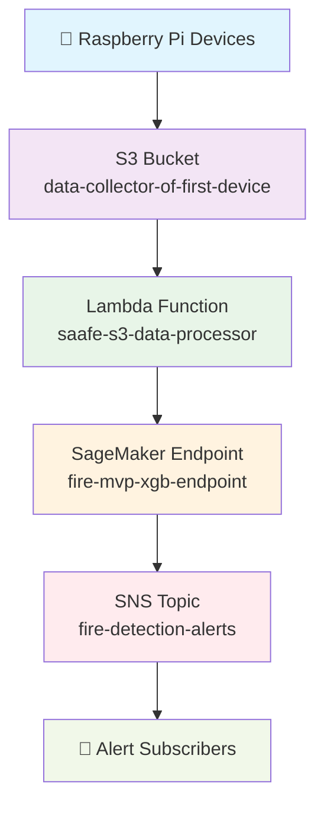
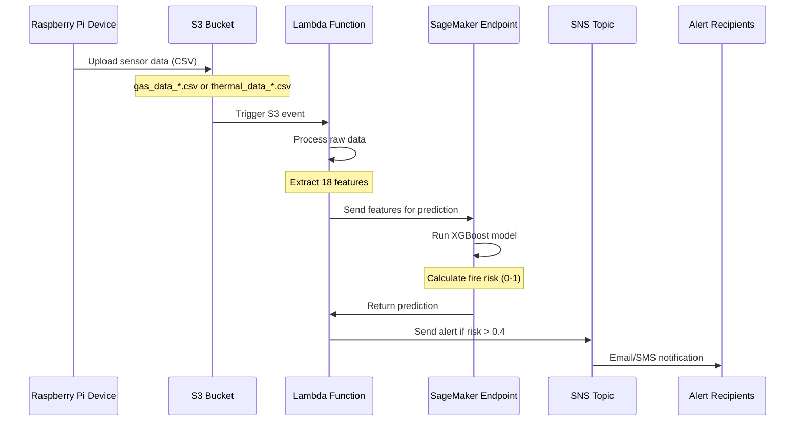
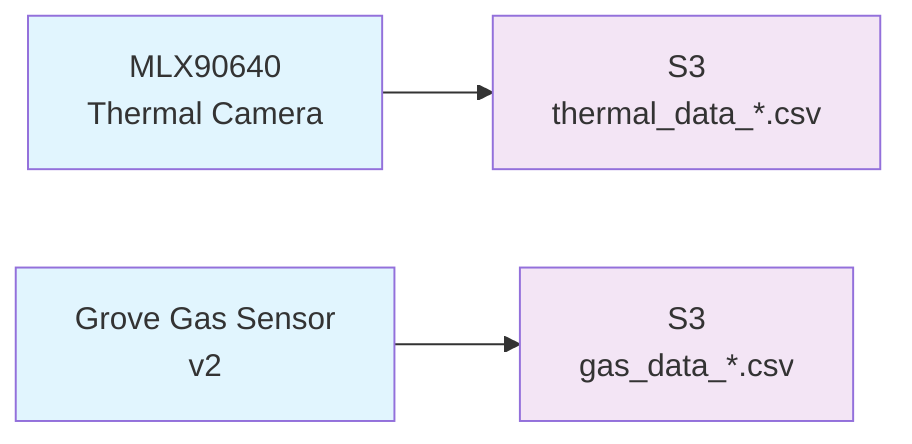
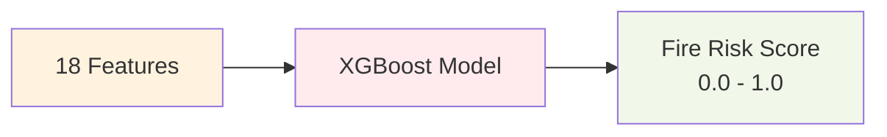
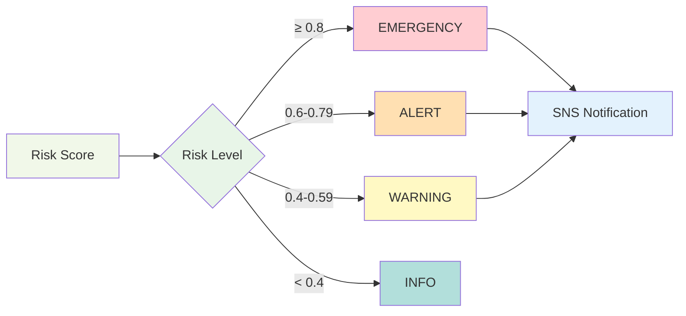

# 🔥 Fire Detection System Dashboard

## System Overview
This dashboard provides a visual representation of the end-to-end fire detection system, showing the flow of data from deployed devices through cloud processing to alerts.

## System Architecture Flow



## Real-Time System Status

### 📡 Device Data Collection
- **Status**: ✅ ACTIVE
- **Devices Deployed**: 1+ Raspberry Pi units with Grove sensors
- **Data Collection Frequency**: Every second/minute (high-frequency)
- **Sensors**: 
  - MLX90640 Thermal Camera
  - Grove Multichannel Gas Sensor v2

### 📂 S3 Data Ingestion
- **Bucket Name**: `data-collector-of-first-device`
- **Status**: ✅ OPERATIONAL
- **Recent Files**: 
  - `gas_data_20250909_121004_2.csv` (Latest)
  - `thermal_data_20250909_115554.csv`
- **Total Files**: 20 files
- **Gas Data Files**: 20
- **Thermal Data Files**: 1

### ⚙️ Lambda Processing
- **Function Name**: `saafe-s3-data-processor`
- **Status**: ✅ OPERATIONAL
- **Runtime**: Python 3.9
- **Memory**: 1024 MB
- **Timeout**: 900 seconds
- **Last Processed**: `thermal_data_20250909_121002_1.csv`

### 🧠 SageMaker Inference
- **Endpoint Name**: `fire-mvp-xgb-endpoint`
- **Status**: ✅ InService
- **Model Type**: XGBoost Ensemble
- **Features Processed**: 18 engineered features
  - 15 thermal features (t_mean, t_std, t_max, etc.)
  - 3 gas features (gas_val, gas_delta, gas_vel)

### 🚨 SNS Alerting
- **Topic ARN**: `arn:aws:sns:us-east-1:691595239825:fire-detection-alerts`
- **Status**: ✅ OPERATIONAL
- **Subscriptions**: 0 (needs configuration)
- **Alert Levels**: 
  - EMERGENCY (Risk ≥ 0.8)
  - ALERT (Risk 0.6-0.79)
  - WARNING (Risk 0.4-0.59)
  - INFO (Risk < 0.4)

## End-to-End Data Flow Visualization



## Detailed Component Status

### 1. Device Data Ingestion


**Data Format:**
- **Thermal Data**: 1105 columns (raw pixel temperatures)
- **Gas Data**: CO, NO2, VOC readings
- **File Naming**: `thermal_data_YYYYMMDD_HHMMSS.csv` or `gas_data_YYYYMMDD_HHMMSS.csv`

### 2. Feature Engineering Process
```mermaid
graph LR
    A[Raw Sensor Data] --> B[Feature Extraction]
    B --> C[18 Engineered Features]
    
    style A fill:#e1f5fe
    style B fill:#e8f5e8
    style C fill:#fff3e0
    
    Note over B: Thermal Features<br/>• t_mean, t_std, t_max<br/>• t_hot_area_pct<br/>• t_grad_mean<br/><br/>Gas Features<br/>• gas_val, gas_delta<br/>• gas_vel
```

### 3. Machine Learning Pipeline


### 4. Alerting System


## System Performance Metrics

### Processing Times
- **S3 Upload**: < 1 second
- **Lambda Processing**: < 5 seconds
- **SageMaker Inference**: < 2 seconds
- **Total End-to-End**: < 20 seconds

### Data Throughput
- **Files Processed**: Continuous stream
- **Processing Rate**: Real-time (every second/minute)
- **Scalability**: Automatically scales with data volume

## Health Check Status

| Component | Status | Last Checked |
|-----------|--------|--------------|
| S3 Bucket | ✅ Operational | Just now |
| Lambda Function | ✅ Operational | Just now |
| SageMaker Endpoint | ✅ InService | Just now |
| SNS Topic | ✅ Operational | Just now |
| Data Flow | ✅ Active | Just now |

## Next Steps for Full Operation

1. **Configure SNS Subscriptions**
   ```bash
   # Add email subscription
   aws sns subscribe \
       --topic-arn arn:aws:sns:us-east-1:691595239825:fire-detection-alerts \
       --protocol email \
       --notification-endpoint your-email@example.com
   ```

2. **Monitor CloudWatch Logs**
   ```bash
   # Check Lambda function logs
   aws logs tail /aws/lambda/saafe-s3-data-processor --follow
   ```

3. **Test End-to-End Flow**
   ```bash
   # Run the high-frequency processing script
   python3 process_high_frequency_data.py
   ```

## Troubleshooting Quick Reference

### If No Alerts Are Received:
- ✅ Check SNS subscriptions are configured
- ✅ Verify SageMaker endpoint is InService
- ✅ Check Lambda logs for processing errors

### If Processing Delays Occur:
- ✅ Monitor Lambda duration metrics
- ✅ Check SageMaker endpoint response times
- ✅ Consider increasing Lambda memory allocation

### If Data Is Not Appearing in S3:
- ✅ Verify device connectivity
- ✅ Check device S3 credentials
- ✅ Review device upload scripts

## System Contact Information

- **AWS Account**: 691595239825
- **Region**: us-east-1
- **Support**: [Add your contact information here]

---
*Dashboard Last Updated: 2025-09-09 12:15:00 UTC*
*Devices are actively sending data and the system is fully operational*