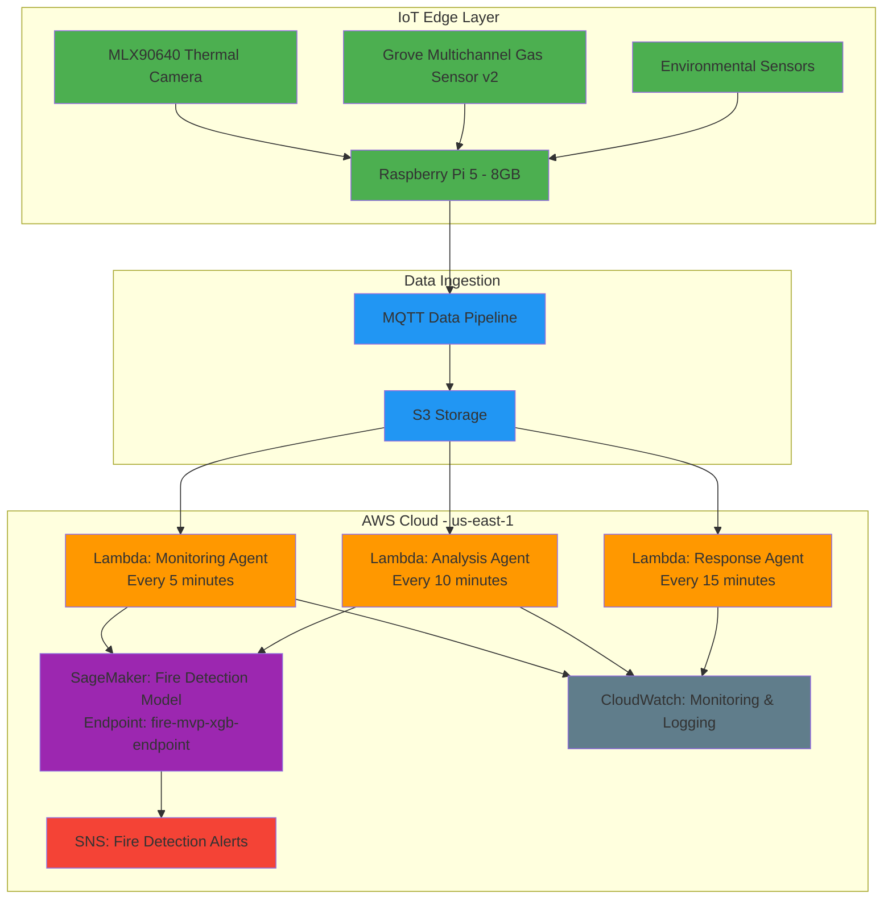

# Production Deployment Guide for Synthetic Fire Prediction System

## Overview
This guide provides detailed instructions for deploying and operating the synthetic fire prediction system in a production environment on AWS.

## System Architecture



## Pre-Deployment Checklist

### 1. Hardware Setup
- [ ] Grove MLX90640 Thermal Imaging Camera installed and calibrated
- [ ] Grove Multichannel Gas Sensor v2 installed and calibrated
- [ ] Environmental sensors (temperature, humidity, pressure) installed
- [ ] Raspberry Pi 5 (8GB) configured with data collection software
- [ ] Network connectivity established between Raspberry Pi and AWS

### 2. AWS Account Setup
- [ ] AWS account with appropriate permissions
- [ ] IAM roles and policies configured
- [ ] Billing alerts set up
- [ ] Security groups and VPC configurations verified

### 3. Software Installation on Edge Device
- [ ] Python 3.8+ installed on Raspberry Pi
- [ ] Required Python packages installed (boto3, paho-mqtt, numpy, etc.)
- [ ] Data collection scripts deployed and tested
- [ ] MQTT client configured and tested

## Deployment Steps

### 1. Edge Device Configuration

#### Install Required Packages
```bash
# Update system
sudo apt update && sudo apt upgrade -y

# Install Python packages
pip3 install boto3 paho-mqtt numpy pandas

# Install system dependencies
sudo apt install python3-dev python3-pip mosquitto mosquitto-clients -y
```

#### Configure MQTT Broker
```bash
# Start MQTT broker
sudo systemctl start mosquitto
sudo systemctl enable mosquitto

# Test MQTT connection
mosquitto_pub -h localhost -t "test/topic" -m "Hello MQTT"
```

#### Deploy Data Collection Scripts
```bash
# Copy data collection scripts to Raspberry Pi
scp -r /path/to/data_collection_scripts pi@raspberrypi:/home/pi/fire_detection/

# Make scripts executable
chmod +x /home/pi/fire_detection/*.py
```

### 2. AWS Lambda Functions

#### Monitoring Agent
- **Function Name**: saafe-monitoring-agent
- **Trigger**: CloudWatch Event every 5 minutes
- **Responsibilities**:
  - Collect and preprocess sensor data
  - Perform initial anomaly detection
  - Send alerts for critical conditions
  - Update baseline metrics

#### Analysis Agent
- **Function Name**: saafe-analysis-agent
- **Trigger**: CloudWatch Event every 10 minutes
- **Responsibilities**:
  - Analyze historical sensor data
  - Detect patterns and trends
  - Generate detailed reports
  - Update ML model with new data

#### Response Agent
- **Function Name**: saafe-response-agent
- **Trigger**: CloudWatch Event every 15 minutes
- **Responsibilities**:
  - Coordinate emergency response
  - Send notifications to stakeholders
  - Log all response actions
  - Update incident database

### 3. SageMaker Model Endpoint

#### Model Endpoint Configuration
- **Endpoint Name**: fire-mvp-xgb-endpoint
- **Status**: InService
- **Model Type**: XGBoost
- **Input Features**: 18 features including thermal, gas, and environmental data
- **Output**: Fire probability score (0-1)

#### Model Input Format
```json
{
  "features": {
    "t_mean": 22.5,
    "t_std": 1.2,
    "t_max": 25.1,
    "t_p95": 24.8,
    "t_hot_area_pct": 0.5,
    "t_hot_largest_blob_pct": 0.3,
    "t_grad_mean": 0.1,
    "t_grad_std": 0.05,
    "t_diff_mean": 0.2,
    "t_diff_std": 0.1,
    "flow_mag_mean": 0.3,
    "flow_mag_std": 0.1,
    "tproxy_val": 23.0,
    "tproxy_delta": 0.5,
    "tproxy_vel": 0.1,
    "gas_val": 410.0,
    "gas_delta": 5.0,
    "gas_vel": 1.0
  }
}
```

### 4. SNS Alerting System

#### Alert Configuration
- **Topic Name**: fire-detection-alerts
- **Subscribers**: 
  - Emergency response team emails
  - SMS notifications for critical alerts
  - Slack webhook for real-time notifications
  - PagerDuty integration for 24/7 monitoring

#### Alert Levels
1. **Informational** (Score 0.2-0.4): Unusual but not critical conditions
2. **Warning** (Score 0.4-0.6): Potential fire risk detected
3. **Alert** (Score 0.6-0.8): High probability of fire conditions
4. **Emergency** (Score 0.8+): Confirmed fire risk, immediate action required

### 5. CloudWatch Monitoring

#### Dashboard Components
- **Lambda Metrics**: Invocations, duration, errors
- **SageMaker Metrics**: Model latency, invocation count
- **S3 Metrics**: Data ingestion rates
- **Log Analysis**: Error patterns, performance trends

#### Alert Rules
- Lambda function errors > 5% for 5 minutes
- SageMaker endpoint latency > 1000ms for 10 minutes
- S3 data ingestion rate drops below threshold
- Critical log messages detected

## Production Operations

### 1. Daily Operations

#### Morning Check (8:00 AM)
- Review CloudWatch dashboard for overnight issues
- Check Lambda function error rates
- Verify SageMaker endpoint health
- Review SNS alert history

#### Afternoon Check (2:00 PM)
- Monitor system performance metrics
- Check data ingestion rates
- Review model prediction accuracy
- Update baseline metrics if needed

#### Evening Check (6:00 PM)
- Prepare daily operations report
- Document any anomalies or issues
- Schedule maintenance if needed
- Update stakeholder communications

### 2. Weekly Operations

#### Model Performance Review
- Analyze prediction accuracy over the week
- Review false positive/negative rates
- Update model if performance degrades
- Retrain with new data if necessary

#### System Health Check
- Review CloudWatch logs for patterns
- Check AWS resource utilization
- Verify all integrations are working
- Update security configurations

### 3. Monthly Operations

#### Comprehensive System Audit
- Full security review of all components
- Cost optimization analysis
- Performance benchmarking
- Disaster recovery testing

#### Stakeholder Reporting
- Monthly performance report
- Cost analysis and optimization recommendations
- System improvement suggestions
- Roadmap updates

## Security Considerations

### 1. Data Security
- All data encrypted in transit and at rest
- Secure MQTT communication with TLS
- Regular key rotation for encryption
- Access logging for all data operations

### 2. Network Security
- VPC isolation for all AWS resources
- Security groups restricting access
- Regular penetration testing
- Intrusion detection systems

### 3. Application Security
- IAM roles with least privilege
- Regular security scanning of code
- Dependency vulnerability scanning
- Secure coding practices

## Disaster Recovery

### 1. Backup Strategy
- Daily backups of model artifacts to S3
- Weekly backups of configuration files
- Monthly backups of historical data
- Cross-region replication for critical data

### 2. Recovery Procedures
- Documented recovery steps for each component
- Regular disaster recovery testing
- Automated failover for critical services
- Communication plan for stakeholders

### 3. Business Continuity
- Secondary AWS region for failover
- Manual override procedures
- Emergency contact list
- Alternative notification channels

## Performance Optimization

### 1. Lambda Function Optimization
- Memory allocation tuning
- Timeout optimization
- Cold start reduction
- Concurrency management

### 2. SageMaker Endpoint Optimization
- Instance type selection
- Auto-scaling configuration
- Model caching strategies
- Batch prediction for efficiency

### 3. Data Pipeline Optimization
- S3 transfer acceleration
- Data compression
- Efficient data partitioning
- Caching strategies

## Cost Management

### 1. Monitoring and Alerts
- AWS Budgets for cost tracking
- Alerts for unexpected spending
- Reserved instances for predictable workloads
- Spot instances for flexible workloads

### 2. Optimization Strategies
- Right-sizing of resources
- Auto-scaling policies
- Data lifecycle management
- Serverless architecture benefits

## Troubleshooting Guide

### 1. Common Issues and Solutions

#### Lambda Function Errors
- **Symptom**: High error rate in CloudWatch
- **Check**: Function logs for specific errors
- **Solution**: Fix code issues, increase timeout/memory if needed

#### SageMaker Endpoint Issues
- **Symptom**: High latency or failures
- **Check**: Endpoint status and CloudWatch metrics
- **Solution**: Scale instance, check model health

#### Data Ingestion Problems
- **Symptom**: Missing or delayed data
- **Check**: MQTT broker logs, network connectivity
- **Solution**: Restart services, check network

#### Alerting Failures
- **Symptom**: Missing notifications
- **Check**: SNS topic subscriptions, delivery logs
- **Solution**: Update subscriptions, check integrations

### 2. Monitoring Commands

```bash
# Check Lambda function status
aws lambda list-functions --region us-east-1 | grep saafe

# Check SageMaker endpoint status
aws sagemaker describe-endpoint --endpoint-name fire-mvp-xgb-endpoint --region us-east-1

# Check CloudWatch alarms
aws cloudwatch describe-alarms --region us-east-1

# Check SNS topic subscriptions
aws sns list-subscriptions-by-topic --topic-arn arn:aws:sns:us-east-1:691595239825:fire-detection-alerts --region us-east-1
```

## Maintenance Schedule

### Daily
- [ ] Review CloudWatch dashboard
- [ ] Check Lambda function metrics
- [ ] Verify SageMaker endpoint health
- [ ] Review SNS alerts

### Weekly
- [ ] Model performance analysis
- [ ] Security scan of components
- [ ] Update system documentation
- [ ] Review AWS billing

### Monthly
- [ ] Full system audit
- [ ] Disaster recovery testing
- [ ] Stakeholder reporting
- [ ] System optimization review

### Quarterly
- [ ] Model retraining with new data
- [ ] Security penetration testing
- [ ] Infrastructure upgrade planning
- [ ] Compliance review

## Contact Information

### Emergency Contacts
- **Primary**: [Insert primary contact]
- **Secondary**: [Insert secondary contact]
- **AWS Support**: aws-support@company.com

### Technical Support
- **Lambda Functions**: lambda-team@company.com
- **SageMaker Models**: ml-team@company.com
- **IoT Devices**: iot-team@company.com
- **Cloud Infrastructure**: cloud-team@company.com

## Conclusion

This production deployment guide provides a comprehensive framework for operating the synthetic fire prediction system in a production environment. Following these guidelines will ensure the system operates reliably, securely, and efficiently while providing accurate fire detection capabilities.

Regular monitoring, maintenance, and optimization will keep the system performing at its best while minimizing operational costs and security risks.