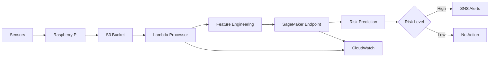

# Production Operations Manual
## Fire Detection System

## Table of Contents
1. [System Overview](#system-overview)
2. [Architecture](#architecture)
3. [Component Operations](#component-operations)
4. [Monitoring and Alerting](#monitoring-and-alerting)
5. [Incident Response](#incident-response)
6. [Maintenance Procedures](#maintenance-procedures)
7. [Troubleshooting](#troubleshooting)
8. [Security Procedures](#security-procedures)
9. [Backup and Recovery](#backup-and-recovery)
10. [Performance Tuning](#performance-tuning)

## System Overview

The Fire Detection System processes high-frequency sensor data collected every second/minute from Grove sensors to provide real-time fire risk assessments. The system leverages AWS cloud services for scalable, reliable processing and alerting.

### Key Features
- Real-time processing of sensor data
- Automatic scaling to handle any data volume
- Multi-level alerting based on risk scores
- Comprehensive monitoring and logging
- Secure cloud-based architecture

### System Components
- **Edge Devices**: Raspberry Pi 5 with Grove sensors
- **Data Storage**: S3 bucket for raw sensor data
- **Processing**: Lambda function for real-time data processing
- **ML Inference**: SageMaker endpoint for fire risk prediction
- **Alerting**: SNS topic for notifications
- **Monitoring**: CloudWatch for logging and metrics

## Architecture

### Data Flow


### Component Interactions
1. Grove sensors collect data every second/minute
2. Raspberry Pi uploads data to S3 as CSV files
3. S3 events trigger Lambda function processing
4. Lambda extracts 18 features from raw data
5. Features sent to SageMaker for prediction
6. High-risk predictions trigger SNS alerts
7. All processing logged in CloudWatch

## Component Operations

### S3 Bucket Operations
**Bucket Name**: `data-collector-of-first-device`

#### Daily Operations
- Monitor storage usage
- Review access logs
- Verify data integrity

#### Management Commands
```bash
# Check bucket size
aws s3 ls s3://data-collector-of-first-device --recursive --human-readable --summarize

# List recent files
aws s3 ls s3://data-collector-of-first-device --recursive | tail -10

# Check bucket policy
aws s3api get-bucket-policy --bucket data-collector-of-first-device
```

### Lambda Function Operations
**Function Name**: `saafe-s3-data-processor`

#### Daily Operations
- Monitor invocation metrics
- Review error logs
- Check execution duration

#### Management Commands
```bash
# Check function configuration
aws lambda get-function --function-name saafe-s3-data-processor

# Monitor invocations
aws cloudwatch get-metric-statistics \
    --namespace AWS/Lambda \
    --metric-name Invocations \
    --dimensions Name=FunctionName,Value=saafe-s3-data-processor \
    --start-time 2025-09-09T00:00:00Z \
    --end-time 2025-09-09T23:59:59Z \
    --period 3600 \
    --statistics Sum

# Check error rates
aws cloudwatch get-metric-statistics \
    --namespace AWS/Lambda \
    --metric-name Errors \
    --dimensions Name=FunctionName,Value=saafe-s3-data-processor \
    --start-time 2025-09-09T00:00:00Z \
    --end-time 2025-09-09T23:59:59Z \
    --period 3600 \
    --statistics Sum
```

### SageMaker Endpoint Operations
**Endpoint Name**: `fire-mvp-xgb-endpoint`

#### Daily Operations
- Monitor endpoint health
- Check prediction latency
- Review model accuracy

#### Management Commands
```bash
# Check endpoint status
aws sagemaker describe-endpoint --endpoint-name fire-mvp-xgb-endpoint

# Monitor endpoint invocations
aws cloudwatch get-metric-statistics \
    --namespace AWS/SageMaker \
    --metric-name Invocations \
    --dimensions Name=EndpointName,Value=fire-mvp-xgb-endpoint \
    --start-time 2025-09-09T00:00:00Z \
    --end-time 2025-09-09T23:59:59Z \
    --period 3600 \
    --statistics Sum

# Check model latency
aws cloudwatch get-metric-statistics \
    --namespace AWS/SageMaker \
    --metric-name ModelLatency \
    --dimensions Name=EndpointName,Value=fire-mvp-xgb-endpoint \
    --start-time 2025-09-09T00:00:00Z \
    --end-time 2025-09-09T23:59:59Z \
    --period 3600 \
    --statistics Average
```

### SNS Topic Operations
**Topic Name**: `fire-detection-alerts`

#### Daily Operations
- Monitor message delivery
- Review subscription status
- Check for failed deliveries

#### Management Commands
```bash
# Check topic attributes
aws sns get-topic-attributes --topic-arn arn:aws:sns:us-east-1:691595239825:fire-detection-alerts

# List subscriptions
aws sns list-subscriptions-by-topic --topic-arn arn:aws:sns:us-east-1:691595239825:fire-detection-alerts

# Publish test message
aws sns publish \
    --topic-arn arn:aws:sns:us-east-1:691595239825:fire-detection-alerts \
    --message "Test alert from operations manual" \
    --subject "Test Alert"
```

## Monitoring and Alerting

### CloudWatch Dashboard
Access the Fire Detection System dashboard to monitor:
- Lambda function performance
- SageMaker endpoint metrics
- S3 storage usage
- System error rates

### Key Metrics to Monitor
1. **Lambda Metrics**
   - Invocations per minute
   - Error rate (< 1%)
   - Average duration (< 10 seconds)

2. **SageMaker Metrics**
   - Model latency (< 1 second)
   - Invocation success rate (> 99%)
   - CPU utilization (< 80%)

3. **S3 Metrics**
   - Storage usage
   - Request rates
   - Error rates

### Alerting Thresholds
- **Critical**: System downtime, > 5% error rate
- **Warning**: > 2% error rate, latency > 30 seconds
- **Info**: Routine operational notifications

### Alert Notification Channels
- Email notifications to operations team
- SMS alerts for critical issues
- Slack integration for real-time updates

## Incident Response

### Incident Classification
1. **Critical**: System unavailable, high error rates
2. **High**: Performance degradation, partial outages
3. **Medium**: Minor issues, elevated error rates
4. **Low**: Routine maintenance, minor alerts

### Response Procedures

#### Critical Incidents
1. **Immediate Actions**
   - Notify incident response team
   - Assess system status
   - Begin troubleshooting

2. **Resolution Steps**
   - Identify root cause
   - Implement fix
   - Verify system recovery
   - Document incident

#### High Priority Incidents
1. **Response Actions**
   - Investigate performance issues
   - Check resource utilization
   - Optimize configurations

2. **Resolution Steps**
   - Apply performance tuning
   - Monitor improvements
   - Update documentation

### Communication Plan
- **Internal**: Operations team, management
- **External**: Customers, stakeholders (if affected)
- **Escalation**: Management hierarchy based on severity

## Maintenance Procedures

### Scheduled Maintenance
#### Weekly Maintenance
- Review system logs
- Update monitoring dashboards
- Check security configurations

#### Monthly Maintenance
- Performance optimization
- Security audits
- Backup verification

#### Quarterly Maintenance
- System upgrades
- Capacity planning
- Compliance reviews

### Maintenance Windows
- **Primary Window**: Saturday 02:00-04:00 UTC
- **Backup Window**: Sunday 02:00-04:00 UTC

### Maintenance Procedures

#### Lambda Function Updates
1. **Preparation**
   - Test updates in staging environment
   - Schedule maintenance window
   - Notify stakeholders

2. **Deployment**
   - Deploy updated function
   - Monitor for errors
   - Rollback if issues detected

3. **Verification**
   - Confirm successful deployment
   - Validate functionality
   - Update documentation

#### SageMaker Model Updates
1. **Model Training**
   - Prepare training data
   - Train new model version
   - Validate model performance

2. **Deployment**
   - Deploy model to staging endpoint
   - Test with sample data
   - Promote to production

3. **Monitoring**
   - Compare performance metrics
   - Monitor for anomalies
   - Rollback if necessary

## Troubleshooting

### Common Issues and Solutions

#### Lambda Function Errors
**Symptom**: High error rates in CloudWatch
**Diagnosis**:
```bash
# Check recent errors
aws logs filter-log-events \
    --log-group-name /aws/lambda/saafe-s3-data-processor \
    --filter-pattern "ERROR"
```

**Solutions**:
1. Check S3 permissions
2. Verify SageMaker endpoint availability
3. Review input data format

#### SageMaker Endpoint Issues
**Symptom**: High latency or timeout errors
**Diagnosis**:
```bash
# Check endpoint status
aws sagemaker describe-endpoint --endpoint-name fire-mvp-xgb-endpoint
```

**Solutions**:
1. Scale endpoint instances
2. Check model loading issues
3. Review network connectivity

#### S3 Access Problems
**Symptom**: Permission denied errors
**Diagnosis**:
```bash
# Check bucket policy
aws s3api get-bucket-policy --bucket data-collector-of-first-device
```

**Solutions**:
1. Update IAM policies
2. Verify bucket permissions
3. Check cross-account access

### Diagnostic Tools

#### Log Analysis
```bash
# Tail CloudWatch logs
aws logs tail /aws/lambda/saafe-s3-data-processor --since 1h

# Search for specific errors
aws logs filter-log-events \
    --log-group-name /aws/lambda/saafe-s3-data-processor \
    --filter-pattern "NoSuchKey"
```

#### Performance Monitoring
```bash
# Check Lambda duration
aws cloudwatch get-metric-statistics \
    --namespace AWS/Lambda \
    --metric-name Duration \
    --dimensions Name=FunctionName,Value=saafe-s3-data-processor \
    --start-time 2025-09-09T00:00:00Z \
    --end-time 2025-09-09T23:59:59Z \
    --period 3600 \
    --statistics Average
```

## Security Procedures

### Access Control
- **Principle of Least Privilege**: Grant minimum required permissions
- **Role-Based Access**: Use IAM roles for service access
- **Multi-Factor Authentication**: Require MFA for privileged accounts

### Security Monitoring
- **Continuous Monitoring**: Real-time security event monitoring
- **Regular Audits**: Monthly security configuration reviews
- **Vulnerability Scanning**: Quarterly vulnerability assessments

### Incident Response
- **Security Breach Protocol**: Immediate isolation and investigation
- **Data Loss Prevention**: Encryption and backup procedures
- **Compliance Reporting**: Regular compliance status reports

### Security Best Practices
1. **Data Encryption**: Enable encryption at rest and in transit
2. **Network Security**: Use VPC and security groups
3. **Identity Management**: Regular access reviews and cleanup
4. **Logging and Monitoring**: Comprehensive audit logging

## Backup and Recovery

### Backup Strategy
- **Daily Backups**: Automated daily backups of critical data
- **Weekly Backups**: Weekly full system backups
- **Monthly Backups**: Monthly archival backups

### Recovery Procedures
1. **Data Recovery**
   - Identify required backup
   - Restore data to staging environment
   - Validate data integrity
   - Promote to production

2. **System Recovery**
   - Deploy from backup images
   - Restore configuration files
   - Validate system functionality
   - Update DNS and load balancers

### Backup Verification
- **Monthly Testing**: Regular restore testing
- **Integrity Checks**: Automated backup validation
- **Documentation**: Maintain backup procedures documentation

### Disaster Recovery
- **Recovery Time Objective (RTO)**: < 4 hours
- **Recovery Point Objective (RPO)**: < 24 hours
- **Recovery Plan**: Documented disaster recovery procedures

## Performance Tuning

### Performance Monitoring
- **Real-time Metrics**: Continuous performance monitoring
- **Trend Analysis**: Weekly performance trend reviews
- **Capacity Planning**: Monthly capacity planning sessions

### Optimization Techniques

#### Lambda Function Optimization
1. **Memory Allocation**: Adjust based on usage patterns
2. **Timeout Settings**: Optimize for processing requirements
3. **Code Efficiency**: Profile and optimize code paths

#### SageMaker Endpoint Optimization
1. **Instance Sizing**: Right-size instance types
2. **Auto-scaling**: Configure auto-scaling policies
3. **Model Optimization**: Optimize model for inference

#### S3 Optimization
1. **Transfer Acceleration**: Enable for large file transfers
2. **Lifecycle Policies**: Implement cost optimization policies
3. **Request Patterns**: Optimize for access patterns

### Performance Testing
- **Load Testing**: Regular load testing sessions
- **Stress Testing**: Periodic stress testing
- **Benchmarking**: Continuous performance benchmarking

## Conclusion

This operations manual provides comprehensive guidance for operating the Fire Detection System in production. Regular adherence to these procedures will ensure system reliability, security, and performance. Continuous monitoring, proactive maintenance, and prompt incident response are key to successful operations.

For additional support, contact the operations team or refer to the system documentation.