# Production System Architecture

## Complete Architecture Diagram

```mermaid
graph TB
    subgraph "On-Premise/IoT Devices"
        A[Grove Sensors] --> B[Raspberry Pi 5]
        C[MLX90640 Thermal Camera] --> B
        D[Grove Multichannel Gas Sensor v2] --> B
    end

    subgraph "AWS Cloud Infrastructure"
        B --> E[S3 Bucket<br/>data-collector-of-first-device]
        E --> F[S3 Event Trigger]
        F --> G[Lambda Function<br/>saafe-s3-data-processor]
        G --> H[Feature Engineering<br/>18 Features Extraction]
        H --> I[SageMaker Endpoint<br/>fire-mvp-xgb-endpoint]
        I --> J[Fire Risk Prediction<br/>0.0-1.0 Score]
        J --> K{Risk Level}
        K -->|> 0.6| L[SNS Topic<br/>fire-detection-alerts]
        K -->|≤ 0.6| M[No Alert]
        L --> N[Alert Notification]
        
        subgraph "Monitoring & Management"
            O[CloudWatch Logs]
            P[CloudWatch Metrics]
            Q[CloudWatch Alarms]
        end
        
        G --> O
        G --> P
        I --> P
    end

    subgraph "User Interface & Operations"
        R[Dashboard<br/>Streamlit UI]
        S[Mobile Alerts]
        T[Email Notifications]
    end

    N --> S
    N --> T
    R --> I

    style A fill:#e1f5fe
    style B fill:#b3e5fc
    style C fill:#e1f5fe
    style D fill:#e1f5fe
    style E fill:#c8e6c9
    style G fill:#fff3e0
    style H fill:#f3e5f5
    style I fill:#f1f8e9
    style J fill:#f1f8e9
    style K fill:#fce4ec
    style L fill:#ffebee
    style O fill:#fafafa
    style P fill:#fafafa
    style Q fill:#fafafa
```

## Component Descriptions

### 1. Edge Devices (On-Premise)
- **Raspberry Pi 5**: Collects and processes sensor data
- **Grove Multichannel Gas Sensor v2**: Collects CO, NO2, VOC readings
- **MLX90640 Thermal Camera**: Captures 32x24 thermal images

### 2. Data Ingestion Layer
- **S3 Bucket**: `data-collector-of-first-device` stores raw sensor data
- **Event Trigger**: Automatically triggers processing on new data arrival

### 3. Processing Layer
- **Lambda Function**: `saafe-s3-data-processor` processes high-frequency data
- **Feature Engineering**: Extracts 18 features from raw sensor data
- **SageMaker Endpoint**: `fire-mvp-xgb-endpoint` provides fire risk predictions

### 4. Alerting & Notification Layer
- **SNS Topic**: `fire-detection-alerts` sends notifications
- **Risk Classification**: Multi-level alerting based on risk scores

### 5. Monitoring & Management
- **CloudWatch**: Comprehensive logging, metrics, and alerting
- **Dashboard**: Streamlit UI for system monitoring and control

## Data Flow

1. Grove sensors collect data every second/minute
2. Raspberry Pi uploads data as CSV files to S3
3. S3 event triggers Lambda function processing
4. Lambda extracts 18 features from raw data
5. Features sent to SageMaker for prediction
6. High-risk predictions trigger SNS alerts
7. All processing logged in CloudWatch