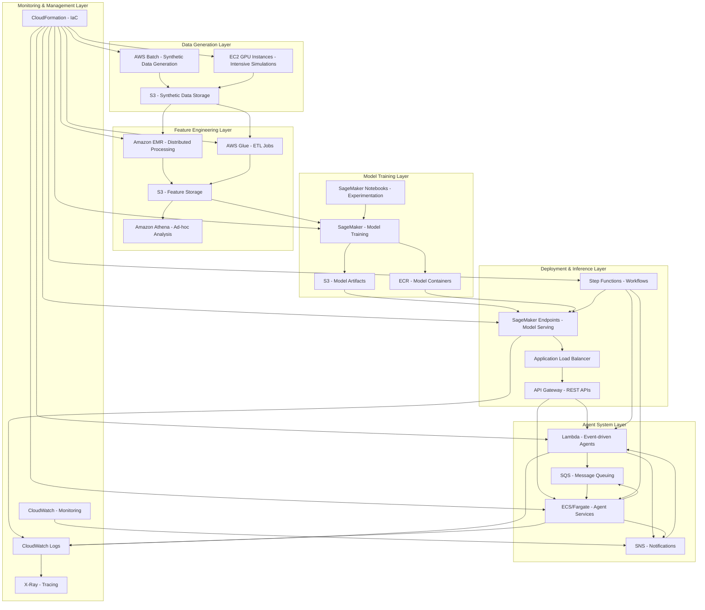

# AWS Architecture for Synthetic Fire Prediction System

## Overview

This document outlines the AWS architecture for implementing the synthetic fire prediction system. The architecture is designed to be robust, highly scalable, and capable of handling variable workloads with occasional massive spikes during testing or incident scenarios.

## Architecture Diagram

## Component Mapping

### 1. Synthetic Data Generation

| System Component | AWS Service | Justification |
|------------------|------------|---------------|
| ThermalImageGenerator | AWS Batch + EC2 GPU Instances | Batch processing for generating large volumes of synthetic thermal images with GPU acceleration for realistic thermal gradients |
| GasConcentrationGenerator | AWS Batch | Scheduled batch jobs for generating synthetic gas concentration data |
| EnvironmentalDataGenerator | AWS Batch | Batch processing for environmental data simulation |
| ScenarioGenerator | AWS Step Functions + AWS Batch | Orchestrated workflows for complex scenario generation |
| Data Storage | Amazon S3 | Scalable, durable storage for all synthetic data types |

### 2. Feature Engineering

| System Component | AWS Service | Justification |
|------------------|------------|---------------|
| FeatureExtractor Base | AWS Glue ETL | Managed ETL service for feature extraction pipelines |
| ThermalFeatureExtractor | Amazon EMR | Distributed processing for compute-intensive thermal feature extraction |
| GasFeatureExtractor | AWS Glue ETL | Structured data processing for gas sensor features |
| EnvironmentalFeatureExtractor | AWS Glue ETL | Processing environmental sensor data into features |
| FeatureFusionEngine | Amazon EMR | Distributed processing for complex feature fusion operations |
| Feature Storage | Amazon S3 + Amazon Athena | S3 for feature storage, Athena for ad-hoc analysis and querying |

### 3. Model Training and Deployment

| System Component | AWS Service | Justification |
|------------------|------------|---------------|
| BaselineModelManager | Amazon SageMaker | Managed ML platform for training baseline models |
| TemporalModelManager | Amazon SageMaker | Deep learning capabilities for LSTM/GRU models |
| ModelEnsemble | Amazon SageMaker | Custom algorithms for ensemble methods |
| Model Experimentation | SageMaker Notebooks | Interactive environment for model development |
| Model Registry | Amazon ECR + S3 | Container registry for model images and S3 for model artifacts |
| Model Deployment | SageMaker Endpoints | Scalable, managed model serving |

### 4. Agent System

| System Component | AWS Service | Justification |
|------------------|------------|---------------|
| AgentCoordinator | Amazon ECS/Fargate | Container orchestration for the central agent coordination service |
| MonitoringAgent | AWS Lambda + ECS | Event-driven functions for real-time monitoring with ECS for persistent monitoring |
| AnalysisAgent | Amazon ECS/Fargate | Container-based service for complex analysis operations |
| ResponseAgent | AWS Lambda + SNS | Serverless functions for immediate response with notification capabilities |
| LearningAgent | Amazon ECS/Fargate | Long-running container for continuous learning and optimization |
| AgentCommunicator | Amazon SQS + SNS | Message queuing and pub/sub for agent communication |

### 5. System Integration and Monitoring

| System Component | AWS Service | Justification |
|------------------|------------|---------------|
| SystemManager | AWS Step Functions | Workflow orchestration for system-wide processes |
| HardwareAbstractionLayer | API Gateway + Lambda | RESTful API interface for hardware abstraction |
| ConfigurationManager | AWS AppConfig | Dynamic configuration management |
| LoggingManager | CloudWatch Logs | Centralized logging solution |
| PerformanceMonitor | CloudWatch | Metrics, alarms, and dashboards |
| Infrastructure Management | CloudFormation | Infrastructure as Code for consistent deployments |

## Detailed Component Descriptions

### Synthetic Data Generation Layer

1. **AWS Batch with EC2 GPU Instances**
   - Runs compute-intensive simulation jobs for generating thermal images, gas diffusion patterns, and environmental data
   - GPU instances provide acceleration for physics-based simulations
   - Spot instances can be used to reduce costs for non-time-critical simulations

2. **Amazon S3 for Synthetic Data Storage**
   - Stores all generated synthetic data including thermal images, gas sensor readings, and environmental data
   - Organizes data by scenario type, timestamp, and sensor type
   - Lifecycle policies to manage data retention based on importance

### Feature Engineering Layer

1. **Amazon EMR**
   - Distributed processing framework for compute-intensive feature extraction
   - Handles large-scale data processing for thermal image feature extraction
   - Supports Spark for complex feature fusion operations

2. **AWS Glue**
   - Managed ETL service for feature extraction pipelines
   - Handles data transformation and feature generation
   - Maintains feature catalog with metadata

3. **Amazon Athena**
   - Provides SQL-based querying capabilities for feature data
   - Enables ad-hoc analysis and feature validation
   - Supports data scientists in exploring feature relationships

### Model Training Layer

1. **Amazon SageMaker**
   - Manages the complete ML lifecycle from data labeling to deployment
   - Provides built-in algorithms and support for custom algorithms
   - Handles distributed training for large models
   - Supports hyperparameter optimization for model tuning

2. **Amazon ECR**
   - Stores custom model containers for training and inference
   - Ensures consistent environments across development and production

3. **SageMaker Notebooks**
   - Interactive environment for data scientists to develop and test models
   - Supports experimentation and visualization

### Agent System Layer

1. **Amazon ECS/Fargate**
   - Runs containerized agent services without managing infrastructure
   - Provides automatic scaling based on demand
   - Ensures high availability for critical agent components

2. **AWS Lambda**
   - Executes event-driven agent functions
   - Scales automatically to handle spikes in event processing
   - Ideal for monitoring and response agents that react to specific triggers

3. **Amazon SQS/SNS**
   - Provides reliable message delivery between agents
   - Decouples agent components for better fault tolerance
   - Enables pub/sub patterns for event distribution

### Deployment & Inference Layer

1. **SageMaker Endpoints**
   - Hosts trained models for real-time inference
   - Provides auto-scaling to handle variable prediction loads
   - Supports A/B testing of different model versions

2. **API Gateway**
   - Exposes RESTful APIs for system interaction
   - Handles authentication and request throttling
   - Provides a unified interface for external systems

3. **Step Functions**
   - Orchestrates complex workflows across multiple AWS services
   - Manages state transitions and error handling
   - Coordinates the execution of agent activities

### Monitoring & Management Layer

1. **CloudWatch**
   - Monitors system metrics and creates alarms
   - Provides dashboards for system visibility
   - Tracks performance against SLAs

2. **CloudWatch Logs**
   - Centralizes logs from all system components
   - Enables log analysis and pattern detection
   - Supports troubleshooting and audit requirements

3. **X-Ray**
   - Provides distributed tracing for request flows
   - Helps identify bottlenecks and performance issues
   - Visualizes service dependencies

4. **CloudFormation**
   - Manages infrastructure as code
   - Ensures consistent deployments across environments
   - Supports version control of infrastructure

## Implementation Considerations

### Scalability

- **Auto-scaling Groups**: All compute resources are configured with auto-scaling to handle variable loads
- **Serverless Components**: Lambda functions scale automatically with no management overhead
- **SageMaker Endpoints**: Configure with auto-scaling to handle prediction traffic spikes
- **EMR Clusters**: Can be dynamically resized based on processing needs

### Performance

- **GPU Acceleration**: Used for compute-intensive simulations and deep learning models
- **Distributed Processing**: EMR for large-scale data processing
- **Caching**: API Gateway caching and CloudFront for content delivery
- **Optimized Storage**: S3 storage classes based on access patterns

### Cost Optimization

- **Spot Instances**: For non-time-critical batch processing
- **Auto-scaling**: Scale down during periods of low activity
- **S3 Lifecycle Policies**: Move infrequently accessed data to cheaper storage tiers
- **Reserved Instances**: For predictable, baseline workloads

### Security

- **IAM Roles**: Least privilege access for all components
- **VPC Configuration**: Private subnets for sensitive components
- **Encryption**: S3 server-side encryption for data at rest
- **API Authentication**: API Gateway with AWS Cognito for authentication

## Deployment Strategy

1. **Infrastructure as Code**
   - Use CloudFormation templates for all infrastructure components
   - Maintain templates in version control
   - Implement CI/CD pipeline for infrastructure changes

2. **Environment Strategy**
   - Development, Testing, and Production environments
   - Consistent configuration across environments
   - Promotion workflow for models and code

3. **Monitoring and Alerting**
   - CloudWatch dashboards for system visibility
   - Alerts for critical metrics and thresholds
   - Regular performance reviews

## Next Steps

1. Create detailed CloudFormation templates for each layer
2. Implement CI/CD pipelines for infrastructure and application code
3. Set up monitoring and alerting based on system KPIs
4. Develop data validation and quality control processes
5. Establish model evaluation and promotion workflows