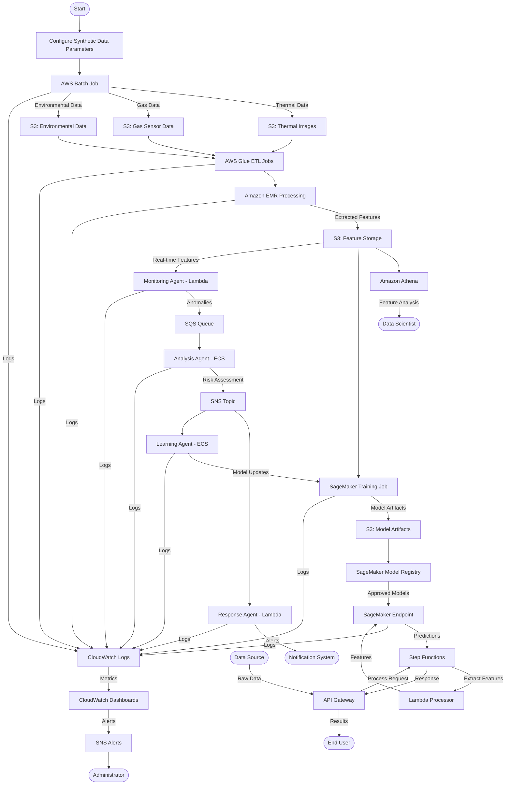
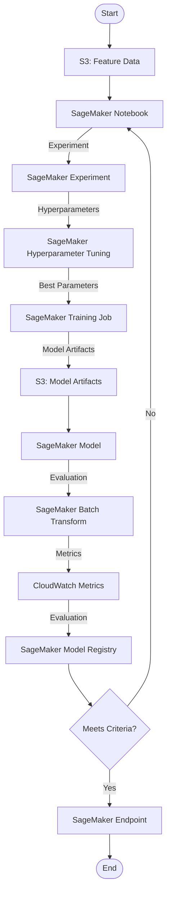
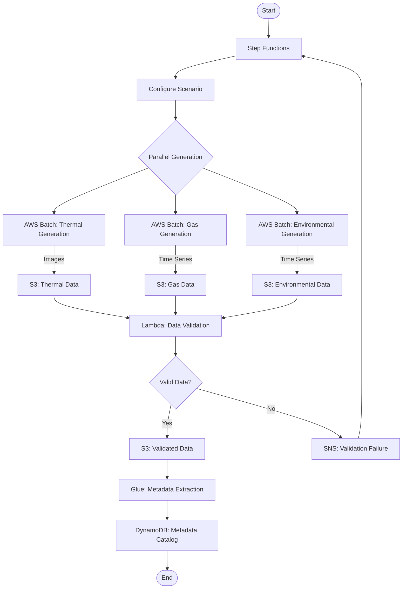
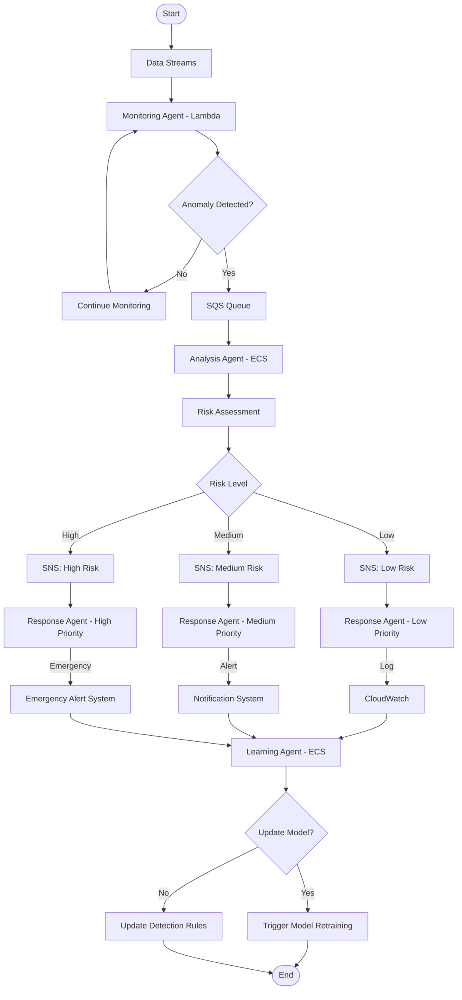

# AWS Workflow Diagrams for Synthetic Fire Prediction System

## Data Flow Diagram



## Training Workflow



## Synthetic Data Generation Workflow



## Agent System Workflow



## Deployment Pipeline

```mermaid
flowchart TD
    Start([Start]) --> CodeCommit[AWS CodeCommit/GitHub]
    CodeCommit --> |Code Changes| CodeBuild[AWS CodeBuild]
    CodeBuild --> |Build Artifacts| CodePipeline[AWS CodePipeline]
    
    CodePipeline --> DeployType{Deployment Type}
    
    DeployType --> |Infrastructure| CFNValidate[CloudFormation Validate]
    CFNValidate --> CFNDeploy[CloudFormation Deploy]
    
    DeployType --> |Application| ECRBuild[ECR Image Build]
    ECRBuild --> ECRPush[ECR Image Push]
    ECRPush --> ECSUpdate[ECS Service Update]
    
    DeployType --> |Model| SMBuild[SageMaker Model Build]
    SMBuild --> SMTest[SageMaker Model Test]
    SMTest --> SMDeploy[SageMaker Model Deploy]
    
    CFNDeploy --> |Success| NotifySuccess[SNS: Success Notification]
    ECSUpdate --> |Success| NotifySuccess
    SMDeploy --> |Success| NotifySuccess
    
    CFNDeploy --> |Failure| NotifyFailure[SNS: Failure Notification]
    ECSUpdate --> |Failure| NotifyFailure
    SMTest --> |Failure| NotifyFailure
    
    NotifySuccess --> End([End])
    NotifyFailure --> Rollback[Automatic Rollback]
    Rollback --> End