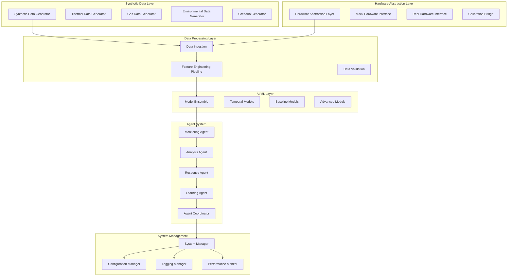

# Design Document

## Overview

The Synthetic Fire Prediction System is designed as a comprehensive AI-powered fire detection platform that uses synthetic data generation to develop, train, and validate the complete system before hardware deployment. The architecture follows a modular, agent-based approach with clear separation between data generation, feature processing, model inference, and response coordination.

The system operates in two phases: (1) Synthetic Development Phase using generated data for system development and validation, and (2) Hardware Integration Phase for seamless transition to real sensors. This design ensures robust fire prediction capabilities with early warning systems while maintaining flexibility for different deployment scenarios.

## Architecture

### High-Level System Architecture



### Data Flow Architecture

The system processes data through a pipeline architecture:

1. **Data Generation/Ingestion** → **Feature Engineering** → **Model Inference** → **Agent Processing** → **Response Generation**

Each stage includes validation, monitoring, and error handling to ensure robust operation.

## Components and Interfaces

### 1. Synthetic Data Generation Framework

#### Thermal Data Generator
- **Purpose**: Generate realistic thermal camera imagery (384×288 resolution)
- **Key Classes**:
  - `ThermalImageGenerator`: Core thermal image generation
  - `HotspotSimulator`: Configurable hotspot modeling
  - `TemporalEvolutionModel`: Fire progression simulation
  - `NoiseInjector`: Realistic sensor noise and interference

```python
class ThermalImageGenerator:
    def generate_thermal_frame(self, scenario_params: dict, timestamp: float) -> np.ndarray
    def simulate_hotspot(self, center: tuple, intensity: float, size: float) -> np.ndarray
    def apply_temporal_evolution(self, previous_frame: np.ndarray, evolution_params: dict) -> np.ndarray
```

#### Gas Data Generator
- **Purpose**: Generate time-series gas concentration data
- **Key Classes**:
  - `GasConcentrationGenerator`: Multi-gas type simulation
  - `DiffusionModel`: Spatial gas distribution modeling
  - `SensorResponseModel`: Realistic sensor characteristics

```python
class GasConcentrationGenerator:
    def generate_gas_reading(self, gas_type: str, scenario: dict, timestamp: float) -> float
    def simulate_diffusion(self, source_location: tuple, gas_properties: dict) -> np.ndarray
    def apply_sensor_characteristics(self, true_concentration: float, sensor_params: dict) -> float
```

#### Environmental Data Generator
- **Purpose**: Generate correlated environmental sensor data
- **Key Classes**:
  - `EnvironmentalDataGenerator`: Temperature, humidity, pressure simulation
  - `VOCPatternGenerator`: Volatile organic compound modeling
  - `CorrelationEngine`: Inter-parameter correlation modeling

### 2. Feature Engineering Pipeline

#### Feature Extraction Framework
- **Purpose**: Extract 18+ features from multi-sensor data in real-time
- **Key Classes**:
  - `FeatureExtractor`: Main feature extraction coordinator
  - `ThermalFeatureExtractor`: Thermal-specific features
  - `GasFeatureExtractor`: Gas sensor features
  - `EnvironmentalFeatureExtractor`: Environmental features
  - `FeatureFusionEngine`: Cross-sensor feature fusion

```python
class FeatureExtractor:
    def extract_all_features(self, sensor_data: dict) -> np.ndarray
    def validate_features(self, features: np.ndarray) -> bool
    def normalize_features(self, features: np.ndarray) -> np.ndarray
```

#### Feature Processing Pipeline
- **Thermal Features**: Max/mean temperature, hotspot area %, entropy, motion detection, temperature rise slope
- **Gas Features**: PPM readings, concentration slopes, peak detection, exceedance counts, z-score anomalies
- **Environmental Features**: VOC slopes, dew point, T/H/P context, environmental anomalies
- **Fusion Features**: Hotspot+gas concurrence, cross-sensor correlations, composite risk scores

### 3. Model Architecture

#### Model Ensemble System
- **Purpose**: Combine multiple model types for robust predictions
- **Key Classes**:
  - `ModelEnsemble`: Main ensemble coordinator
  - `TemporalModelManager`: LSTM/GRU/Transformer models
  - `BaselineModelManager`: Random Forest, XGBoost models
  - `ConfidenceCalculator`: Prediction confidence scoring

```python
class ModelEnsemble:
    def predict(self, features: np.ndarray) -> tuple[float, float]  # prediction, confidence
    def update_ensemble_weights(self, performance_metrics: dict) -> None
    def select_optimal_models(self, validation_results: dict) -> list
```

#### Model Types
- **Temporal Models**: LSTM, GRU, Temporal Convolutional Networks for sequence processing
- **Baseline Models**: Random Forest, XGBoost for robust baseline performance
- **Advanced Models**: Attention mechanisms, Graph Neural Networks for complex pattern recognition

### 4. Multi-Agent System

#### Agent Framework
- **Purpose**: Coordinate specialized agents for different system functions
- **Key Classes**:
  - `AgentCoordinator`: Central agent management
  - `AgentCommunicator`: Inter-agent communication
  - `AgentStateManager`: Agent state and history tracking

#### Specialized Agents

**Monitoring Agent**
```python
class MonitoringAgent:
    def monitor_data_streams(self) -> dict
    def detect_anomalies(self, data: dict) -> list
    def prioritize_attention(self, anomalies: list) -> list
    def assess_sensor_health(self, sensor_data: dict) -> dict
```

**Analysis Agent**
```python
class AnalysisAgent:
    def analyze_patterns(self, data: dict, anomalies: list) -> dict
    def correlate_historical_data(self, current_pattern: dict) -> dict
    def calculate_confidence_level(self, analysis: dict) -> float
    def generate_risk_assessment(self, analysis: dict) -> dict
```

**Response Agent**
```python
class ResponseAgent:
    def determine_response_level(self, risk_assessment: dict) -> str
    def distribute_alerts(self, response_level: str, details: dict) -> None
    def generate_recommendations(self, risk_assessment: dict) -> list
    def implement_escalation(self, response_level: str) -> None
```

**Learning Agent**
```python
class LearningAgent:
    def track_performance_metrics(self, predictions: list, outcomes: list) -> dict
    def analyze_error_patterns(self, errors: list) -> dict
    def recommend_retraining(self, performance_metrics: dict) -> bool
    def optimize_agent_behaviors(self, outcomes: dict) -> dict
```

### 5. Hardware Abstraction Layer

#### Hardware Interface Design
- **Purpose**: Enable seamless transition from synthetic to real hardware
- **Key Classes**:
  - `HardwareAbstractionLayer`: Main hardware interface
  - `MockHardwareInterface`: Synthetic data simulation
  - `RealHardwareInterface`: Actual sensor integration
  - `CalibrationBridge`: Synthetic-to-real calibration

```python
class HardwareAbstractionLayer:
    def get_sensor_data(self) -> dict
    def calibrate_sensors(self, calibration_params: dict) -> None
    def validate_sensor_health(self) -> dict
    def switch_data_source(self, source_type: str) -> None
```

## Data Models

### Core Data Structures

#### SensorData
```python
@dataclass
class SensorData:
    timestamp: float
    thermal_frame: np.ndarray  # 384x288 thermal image
    gas_readings: dict[str, float]  # gas_type -> concentration
    environmental_data: dict[str, float]  # parameter -> value
    sensor_health: dict[str, float]  # sensor_id -> health_score
```

#### FeatureVector
```python
@dataclass
class FeatureVector:
    timestamp: float
    thermal_features: np.ndarray  # 8 thermal features
    gas_features: np.ndarray  # 5 gas features
    environmental_features: np.ndarray  # 4 environmental features
    fusion_features: np.ndarray  # 3 fusion features
    feature_quality: float
```

#### PredictionResult
```python
@dataclass
class PredictionResult:
    timestamp: float
    fire_probability: float
    confidence_score: float
    lead_time_estimate: float
    contributing_factors: dict[str, float]
    model_ensemble_votes: dict[str, float]
```

#### RiskAssessment
```python
@dataclass
class RiskAssessment:
    timestamp: float
    risk_level: str  # LOW, MEDIUM, HIGH, CRITICAL
    fire_probability: float
    confidence_level: float
    contributing_sensors: list[str]
    recommended_actions: list[str]
    escalation_required: bool
```

### Database Schema

#### Synthetic Data Storage
- **thermal_data**: timestamp, scenario_id, thermal_frame_path, metadata
- **gas_data**: timestamp, scenario_id, gas_type, concentration, sensor_params
- **environmental_data**: timestamp, scenario_id, temperature, humidity, pressure, voc_levels
- **scenarios**: scenario_id, scenario_type, parameters, duration, labels

#### Model Performance Tracking
- **model_performance**: model_id, timestamp, accuracy, precision, recall, f1_score
- **prediction_history**: timestamp, model_id, prediction, confidence, actual_outcome
- **agent_actions**: timestamp, agent_type, action, parameters, outcome

## Error Handling

### Error Categories and Strategies

#### Data Generation Errors
- **Physics Validation Failures**: Implement constraint checking and parameter validation
- **Scenario Generation Errors**: Fallback to default scenarios with logging
- **Export Format Errors**: Multiple format support with graceful degradation

#### Feature Engineering Errors
- **Missing Data Handling**: Interpolation and imputation strategies
- **Feature Quality Issues**: Quality scoring and feature filtering
- **Real-time Processing Failures**: Buffering and retry mechanisms

#### Model Inference Errors
- **Model Loading Failures**: Model fallback hierarchy and error recovery
- **Prediction Anomalies**: Confidence thresholding and uncertainty quantification
- **Ensemble Disagreement**: Voting mechanisms and conflict resolution

#### Agent System Errors
- **Agent Communication Failures**: Message queuing and retry logic
- **Agent State Corruption**: State validation and recovery procedures
- **Coordination Failures**: Fallback to manual override modes

### Error Recovery Mechanisms

1. **Graceful Degradation**: System continues operation with reduced functionality
2. **Automatic Retry**: Configurable retry logic with exponential backoff
3. **Fallback Systems**: Alternative processing paths for critical functions
4. **State Recovery**: Checkpoint-based recovery for long-running processes
5. **Alert Generation**: Immediate notification of critical system errors

## Testing Strategy

### Synthetic Data Validation Testing
- **Physics Consistency Tests**: Validate thermal and gas diffusion models against known physics
- **Statistical Distribution Tests**: Ensure synthetic data matches expected statistical properties
- **Scenario Coverage Tests**: Verify all fire types and edge cases are properly represented
- **Data Quality Tests**: Validate noise models and sensor characteristic simulation

### Feature Engineering Testing
- **Feature Extraction Tests**: Unit tests for each feature extraction algorithm
- **Real-time Performance Tests**: Validate 100ms processing latency requirement
- **Feature Quality Tests**: Ensure feature consistency and validity
- **Integration Tests**: End-to-end feature pipeline validation

### Model Performance Testing
- **Accuracy Tests**: Validate 90% minimum accuracy requirement on synthetic data
- **Latency Tests**: Ensure 500ms maximum prediction latency
- **Robustness Tests**: Test model performance under various noise conditions
- **Ensemble Tests**: Validate ensemble improvement over individual models

### Agent System Testing
- **Agent Communication Tests**: Validate inter-agent message passing
- **Agent Behavior Tests**: Test each agent's decision-making logic
- **System Integration Tests**: End-to-end agent coordination testing
- **Failure Recovery Tests**: Test system behavior under agent failures

### Hardware Abstraction Testing
- **Mock Interface Tests**: Validate synthetic data integration
- **Calibration Tests**: Test synthetic-to-real data calibration procedures
- **Performance Tests**: Validate hardware abstraction layer overhead
- **Integration Tests**: Test seamless switching between synthetic and real data

### Performance and Load Testing
- **Throughput Tests**: Validate system performance under high data volumes
- **Memory Usage Tests**: Ensure efficient memory utilization
- **Long-duration Tests**: Validate system stability over extended periods
- **Stress Tests**: Test system behavior under extreme conditions

This comprehensive design provides a solid foundation for implementing the synthetic data-first fire prediction system with clear interfaces, robust error handling, and thorough testing strategies.