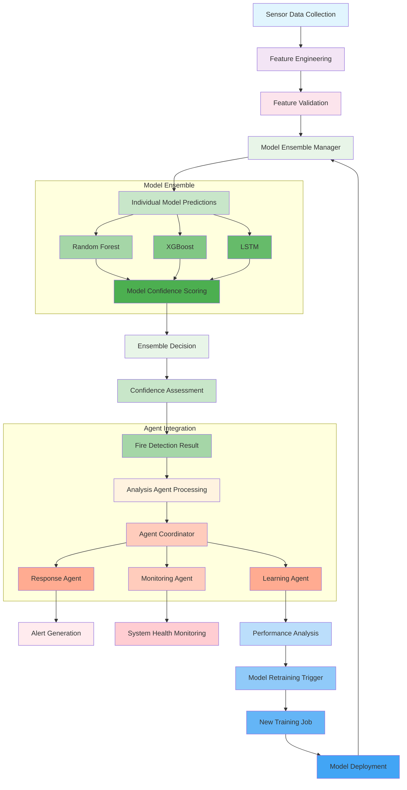

# ML Model Integration Flow

## Detailed Flow Diagram

## Detailed Component Documentation

### 1. Sensor Data Collection

The system collects data from multiple sources:

#### FLIR Lepton 3.5 Thermal Camera
- Captures 160×120 pixel thermal images at 9 Hz
- Provides temperature measurements across the entire field of view
- Raw data includes temperature arrays that are processed into features

#### SCD41 CO₂ Sensor
- Measures CO₂ concentration which increases during combustion
- Provides readings every 5 seconds
- Calculates delta and velocity features from consecutive readings

#### Data Synchronization
- Timestamps all sensor readings for temporal alignment
- Handles missing data through interpolation
- Validates data integrity before processing

### 2. Feature Engineering

Transforms raw sensor data into standardized features for model consumption:

#### Thermal Feature Extraction
1. Statistical measures: mean, standard deviation, maximum, 95th percentile
2. Spatial analysis: hot area percentage, largest blob analysis
3. Gradient analysis: temperature gradients and differences
4. Motion detection: optical flow magnitude analysis
5. Proxy measures: temperature proxy value, delta, and velocity

#### Gas Feature Extraction
1. Absolute CO₂ concentration
2. Change from previous reading (delta)
3. Rate of change (velocity)

#### Feature Validation
- Ensures all 18 features are present and within expected ranges
- Flags data quality issues
- Handles missing values through appropriate strategies

### 3. Model Ensemble Manager

Central component that orchestrates ML model predictions:

#### Model Loading
- Loads trained models from AWS S3 storage
- Validates model integrity
- Initializes model weights based on validation performance

#### Prediction Pipeline
1. Preprocesses input features (scaling, normalization)
2. Routes data to individual models
3. Collects predictions from all models
4. Applies confidence scoring to each prediction
5. Combines predictions using weighted ensemble approach

#### Individual Models

##### Random Forest
- 200 decision trees with max depth of 15
- Handles feature interactions well
- Provides good baseline performance
- Fast inference time

##### XGBoost
- Gradient boosting machine with 200 estimators
- Optimized for accuracy
- Handles imbalanced datasets effectively
- Provides feature importance metrics

##### LSTM
- Recurrent neural network for temporal pattern recognition
- Sequence length of 30 time steps
- Bidirectional architecture for context awareness
- Captures time-dependent fire signatures

#### Ensemble Strategy
- Weighted voting based on individual model performance
- Confidence-weighted combination for robust predictions
- Uncertainty quantification for risk assessment

### 4. Confidence Assessment

Evaluates prediction reliability:

#### Confidence Scoring Methods
1. **Probability-based**: Uses model prediction probabilities
2. **Variance-based**: Measures prediction consistency across models
3. **Entropy-based**: Quantifies prediction uncertainty

#### Threshold Application
- Configurable confidence threshold (default: 0.7)
- Fire detection only triggered when confidence exceeds threshold
- Lower confidence predictions trigger monitoring rather than alerts

### 5. Agent Integration

#### Analysis Agent Connection
- Receives model predictions and confidence scores
- Combines ML results with rule-based pattern analysis
- Calculates overall fire detection confidence
- Generates detailed analysis reports

#### Agent Coordinator Role
- Routes analysis results to appropriate agents
- Manages inter-agent communication
- Maintains system-wide state information

#### Response Agent Utilization
- Uses confidence scores to determine response level
- Generates appropriate alerts based on detection certainty
- Implements escalation protocols for high-confidence detections

#### Learning Agent Feedback
- Collects performance data from all predictions
- Tracks true positives, false positives, and false negatives
- Identifies patterns in model errors
- Triggers retraining when performance degrades

### 6. Continuous Learning Loop

#### Performance Monitoring
- Real-time tracking of accuracy, precision, and recall
- Detection of concept drift in incoming data
- Alerting on significant performance changes

#### Retraining Trigger Conditions
- Sufficient new data collected (configurable threshold)
- Performance degradation detected
- Scheduled retraining intervals
- Manual trigger for model updates

#### Model Deployment Pipeline
1. Training job initiation on AWS SageMaker
2. Model validation on test set
3. A/B testing with current production model
4. Gradual rollout to production
5. Rollback capability for performance issues

## Integration with AWS Services

### SageMaker Integration
- Training jobs for model development
- Endpoint deployment for real-time inference
- Model registry for version management
- Automatic scaling based on demand

### S3 Integration
- Storage of training data and models
- Backup of system logs and performance metrics
- Configuration file management
- Model artifact versioning

### IoT Core Integration
- Device communication and management
- Secure data ingestion from sensors
- Rule engine for alert routing
- Device shadow synchronization

## Security Considerations

### Data Protection
- Encryption at rest and in transit
- Secure access controls to AWS resources
- Regular security audits
- Compliance with relevant standards

### Model Security
- Model integrity verification
- Protection against adversarial attacks
- Secure model deployment practices
- Regular model validation

## Scalability Features

### Horizontal Scaling
- Multiple sensor nodes supported
- Distributed processing capabilities
- Load balancing across inference endpoints
- Auto-scaling based on data volume

### Vertical Scaling
- Increasing model complexity as needed
- Adding new sensor types
- Expanding feature set
- Enhancing ensemble strategies

## Monitoring and Maintenance

### System Health
- Real-time monitoring of all components
- Automated alerts for system issues
- Performance dashboards
- Historical trend analysis

### Model Maintenance
- Regular performance evaluation
- Automated model updates
- A/B testing framework
- Rollback procedures