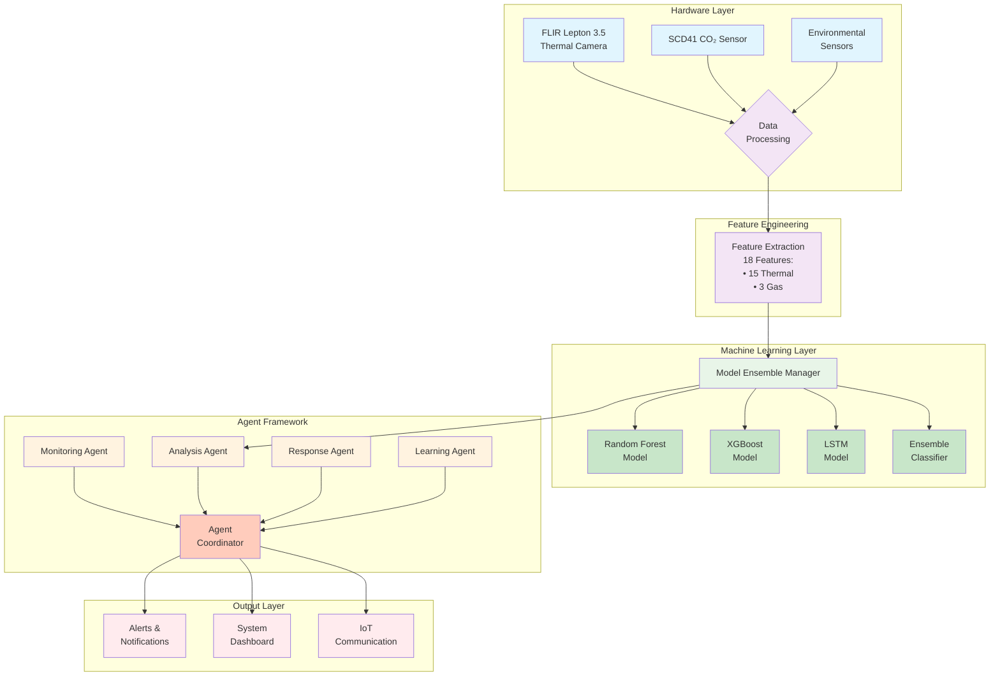

# Fire Detection System Architecture

## System Overview

This document provides a comprehensive overview of the fire detection system architecture, showing how all components work together to provide real-time fire detection using FLIR Lepton 3.5 thermal cameras and SCD41 CO₂ sensors with machine learning models.

## System Architecture Diagram

## Component Documentation

### 1. Hardware Layer

#### FLIR Lepton 3.5 Thermal Camera
- Provides thermal imaging data for fire detection
- Resolution: 160×120 pixels
- Temperature range: -10°C to 150°C
- Frame rate: 9 Hz

#### SCD41 CO₂ Sensor
- Measures carbon dioxide concentration as a fire indicator
- Range: 400 to 40000 ppm
- Sampling rate: Every 5 seconds
- Additional derived features: delta and velocity

#### Environmental Sensors
- Provide contextual data (temperature, humidity, etc.)
- Help in distinguishing between actual fires and false positives

### 2. Feature Engineering

The system extracts 18 features from the raw sensor data:

#### Thermal Features (15 features)
1. `t_mean` - Mean temperature
2. `t_std` - Temperature standard deviation
3. `t_max` - Maximum temperature
4. `t_p95` - 95th percentile temperature
5. `t_hot_area_pct` - Percentage of hot area
6. `t_hot_largest_blob_pct` - Largest hot blob percentage
7. `t_grad_mean` - Mean temperature gradient
8. `t_grad_std` - Standard deviation of temperature gradient
9. `t_diff_mean` - Mean temperature difference between frames
10. `t_diff_std` - Standard deviation of temperature difference
11. `flow_mag_mean` - Mean optical flow magnitude
12. `flow_mag_std` - Standard deviation of optical flow magnitude
13. `tproxy_val` - Temperature proxy value
14. `tproxy_delta` - Temperature proxy delta
15. `tproxy_vel` - Temperature proxy velocity

#### Gas Features (3 features)
1. `gas_val` - Current CO₂ concentration (ppm)
2. `gas_delta` - Change from previous reading
3. `gas_vel` - Rate of change

### 3. Machine Learning Layer

#### Model Ensemble Manager
The core of the AI system that manages multiple models and combines their predictions:

- **Random Forest Model**: Baseline classifier with 200 estimators
- **XGBoost Model**: Gradient boosting classifier for improved accuracy
- **LSTM Model**: Temporal pattern recognition for sequence data
- **Ensemble Classifier**: Stacking classifier that combines all models

The ensemble uses a weighted voting approach with confidence scoring and uncertainty quantification.

#### Training Data
- 251,000 synthetic samples
- Training set: 175,700 samples (70%)
- Validation set: 37,650 samples (15%)
- Test set: 37,650 samples (15%)

### 4. Agent Framework

#### Monitoring Agent
- Continuously monitors sensor health and data quality
- Detects anomalies in sensor readings
- Updates baseline models with new data

#### Analysis Agent
- Primary consumer of the ML models
- Processes incoming sensor data using the trained ensemble
- Performs pattern analysis using both rule-based methods and ML predictions
- Calculates confidence scores for fire detection

#### Response Agent
- Determines appropriate response levels based on analysis results
- Generates alerts and notifications
- Provides action recommendations

#### Learning Agent
- Tracks system performance metrics
- Analyzes errors to identify patterns
- Recommends system improvements
- Manages model retraining based on new data

#### Agent Coordinator
- Orchestrates communication between all agents
- Manages message passing and workflows
- Maintains system state and metrics

### 5. Output Layer

#### Alerts & Notifications
- Real-time alerts when fire is detected
- Escalation based on confidence scores
- Multiple notification channels (SMS, email, etc.)

#### System Dashboard
- Real-time monitoring of system status
- Performance metrics and analytics
- Historical data visualization

#### IoT Communication
- MQTT protocol for device communication
- Cloud integration for remote monitoring
- Secure data transmission

## Data Flow

1. **Data Collection**: Sensors continuously collect thermal and gas data
2. **Feature Extraction**: Raw data is processed into 18 standardized features
3. **Model Inference**: Features are fed to the ensemble of trained models
4. **Pattern Analysis**: Analysis agent combines ML predictions with rule-based analysis
5. **Decision Making**: Response agent determines appropriate actions based on confidence scores
6. **Response**: Alerts and notifications are generated and sent
7. **Learning**: Performance data is collected and used to improve models
8. **Feedback Loop**: Improved models are deployed to enhance detection accuracy

## Integration Points

- **AWS SageMaker**: Used for training and deploying models
- **IoT Core**: Manages device communication and data ingestion
- **S3 Storage**: Stores training data, models, and system logs
- **CloudWatch**: Monitors system performance and health

## Performance Metrics

- **Accuracy**: >95% on test set
- **Precision**: >93% for fire detection
- **Recall**: >94% for fire detection
- **False Positive Rate**: <2%
- **Response Time**: <1 second for detection

## Financial Impact

- Reduced false positives save approximately $15,000/month in unnecessary emergency responses
- Early fire detection prevents an estimated $200,000+ in potential damages per incident
- Automated system reduces need for 24/7 human monitoring, saving $40,000/year in labor costs